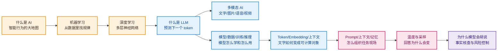

---
tags:
  - AI 基础
---

# AI 基础总览

AI 基础 · 总览

<strong>这一章帮你搭一张 AI 地图。</strong>从 AI、机器学习、深度学习一路走到 LLM、多模态、Token、Prompt、采样参数和幻觉。读完后，你再看 ChatGPT、Claude、Gemini、RAG、Agent 这些词，脑子里会有一条清楚的线。

<strong>看懂概念</strong> AI / ML / DL / LLM

<strong>看懂机制</strong> 数据、训练、推理、Token

<strong>看懂边界</strong> 上下文、采样、幻觉、核查

> 这一页是「AI 基础」章节的入口。你可以把它当路线图，也可以当复习清单。

## 这章解决什么问题

刚开始学 AI，最容易卡在三个地方。

一个是**词太多**：AI、ML、DL、LLM、GenAI、多模态、Transformer、Embedding、Context window，全都挤在一起。

一个是**体验太像魔法**：你输入一句话，模型开始写答案、改代码、看图片、总结文档。它表现得像懂了你，但背后其实是一套数据、模型、推理和采样流程。

还有一个是**风险太隐蔽**：模型会写得很顺，也会编造引用、误读材料、泄露隐私、继承偏见。UNESCO 在生成式 AI 教育指南中强调，学习者需要理解工具如何运作、如何验证、如何保护隐私，并保持以人为本的使用方式；NIST 的 [AI 600-1 生成式 AI 风险画像](https://nvlpubs.nist.gov/nistpubs/ai/NIST.AI.600-1.pdf) 也把 confabulation / hallucination、信息完整性、隐私、偏见和滥用列为关键风险。

所以这一章不追求把你直接训练成算法工程师。它的目标更现实：让你知道每个词在整张地图上的位置，知道该从哪篇开始读，知道什么时候该信，什么时候该查。

## 一张图看懂学习路线

这条线可以拆成四段。

| 阶段 | 你要建立的直觉 | 对应章节 |
| --- | --- | --- |
| 认识 AI 大地图 | AI 是总称，机器学习是其中一条路线，深度学习是现代 AI 的关键技术分支 | [什么是 AI](what-is-ai.md)、[机器学习](machine-learning.md)、[深度学习](deep-learning.md) |
| 进入 LLM 世界 | LLM 生成文字靠 token 级预测，现代生成式 AI 又把文本、图像、语音、视频接到一起 | [什么是 LLM](what-is-llm.md)、[多模态 AI](multimodal-ai.md) |
| 拆开模型工作流 | 数据、训练、推理、Token、Embedding、上下文窗口决定了模型能力和调用成本 | [模型、数据、训练与推理](model-data-training.md)、[Token、Embedding 与上下文窗口](token-embedding-context.md) |
| 学会稳定使用 | Prompt 组织任务现场，采样参数影响输出风格，事实核查处理幻觉风险 | [Prompt、上下文和记忆](prompt-context-memory.md)、[温度与采样参数](temperature-sampling.md)、[为什么模型会胡说](hallucination.md) |

IBM 在 [AI、机器学习、深度学习与神经网络的对比文章](https://www.ibm.com/think/topics/ai-vs-machine-learning-vs-deep-learning-vs-neural-networks)中把四者整理成层级关系：AI 是最宽的概念，机器学习属于 AI，深度学习属于机器学习，神经网络是深度学习算法的重要基础。Google Cloud 的 [AI 与机器学习介绍](https://cloud.google.com/learn/artificial-intelligence-vs-machine-learning)也采用了类似解释：AI 关注让系统感知、推理、行动和调整，机器学习关注从数据中学习。

## 如果你时间有限

直接读这四篇。

<a href="what-is-ai.md" style="display:block;text-decoration:none;color:inherit;padding:1rem;border-radius:0.9rem;border:1px solid rgba(255,112,67,0.26);background:linear-gradient(135deg,rgba(255,112,67,0.11),rgba(255,112,67,0.02));">
<strong>1. 什么是 AI</strong> 先知道这张大地图有多大
</a>
<a href="what-is-llm.md" style="display:block;text-decoration:none;color:inherit;padding:1rem;border-radius:0.9rem;border:1px solid rgba(126,87,194,0.26);background:linear-gradient(135deg,rgba(126,87,194,0.11),rgba(126,87,194,0.02));">
<strong>2. 什么是 LLM</strong> 理解聊天模型怎么生成文字
</a>
<a href="prompt-context-memory.md" style="display:block;text-decoration:none;color:inherit;padding:1rem;border-radius:0.9rem;border:1px solid rgba(33,150,243,0.26);background:linear-gradient(135deg,rgba(33,150,243,0.10),rgba(33,150,243,0.02));">
<strong>3. Prompt、上下文和记忆</strong> 学会组织一场有效对话
</a>
<a href="hallucination.md" style="display:block;text-decoration:none;color:inherit;padding:1rem;border-radius:0.9rem;border:1px solid rgba(233,30,99,0.26);background:linear-gradient(135deg,rgba(233,30,99,0.10),rgba(233,30,99,0.02));">
<strong>4. 为什么模型会胡说</strong> 知道哪些回答必须回到来源核查
</a>

这四篇是使用 LLM 的最小必要知识。你会知道 AI 是什么、LLM 怎么生成答案、Prompt 怎么影响结果，以及为什么模型会自信地出错。

## 如果你想系统学习

按导航顺序读就行。

<strong>第 1 站：[什么是 AI](what-is-ai.md)</strong>

从达特茅斯会议、图灵测试、AI 三次浪潮讲起，先把人工智能放进历史里。

<strong>第 2 站：[机器学习](machine-learning.md)</strong>

理解计算机怎么从例子里学规律，分清监督学习、无监督学习和强化学习。

<strong>第 3 站：[深度学习](deep-learning.md)</strong>

看懂神经网络的层级结构，以及 AlexNet 之后深度学习为什么突然爆发。

<strong>第 4 站：[什么是 LLM](what-is-llm.md)</strong>

把聊天窗口拆开，看见 token、上下文、Transformer 和下一个 token 预测。

<strong>第 5 站：[多模态 AI](multimodal-ai.md)</strong>

把文字、图片、语音和视频放进同一张图里，理解「统一入口」怎么形成。

<strong>第 6 站：[模型、数据、训练与推理](model-data-training.md)</strong>

看懂模型从原始数据到上线服务的完整链路，也顺手理解为什么 AI 调用按 token 收费。

<strong>第 7 站：[Token、Embedding 与上下文窗口](token-embedding-context.md)</strong>

理解文字如何变成数字，语义如何进入向量空间，上下文窗口为什么会限制模型记忆。

<strong>第 8 站：[Prompt、上下文和记忆](prompt-context-memory.md)</strong>

分清用户输入、系统规则、聊天历史、长期记忆和工具消息，各自负责什么。

<strong>第 9 站：[温度与采样参数](temperature-sampling.md)</strong>

看懂 temperature、top-k、top-p、seed 和惩罚项，知道怎么在稳定与发散之间调节。

<strong>第 10 站：[为什么模型会胡说](hallucination.md)</strong>

理解幻觉、事实核查、Grounding、引用证据和高风险场景里的人工复核。

Google 的 [Machine Learning Crash Course](https://developers.google.com/machine-learning.mdcrash-course) 也采用类似路径：先学回归、分类、数据处理、泛化和过拟合，再进入神经网络、Embedding 和大型语言模型。Hugging Face 的 [NLP Course](https://huggingface.co/learn/nlp-course/chapter1/1) 则把 Transformer、pipeline、Tokenizer、Encoder / Decoder 架构作为进入现代 NLP 和 LLM 的入口。

## 学 AI 基础时，抓住三条线

### 1. 从「任务」看 AI

别一上来钻进公式。先看 AI 正在解决什么任务。

识别图片、过滤垃圾邮件、推荐视频、预测故障、翻译文本、生成代码、整理会议纪要，这些任务背后的技术路线不同，但都可以放进 AI 这张大地图。理解任务，你才知道该看哪一类模型、哪一种数据、哪种评估方式。

### 2. 从「流程」看模型

现代 LLM 可以拆成一条很朴素的流程。

<pre><code>数据 → 训练 → 模型 → 推理 → 输出 → 评估 → 迭代</code></pre>
OpenAI 的 [Text generation 文档](https://developers.openai.com/api/docs/guides/text) 用 Responses API 展示了输入、指令、输出、结构化结果和文件输入的关系；Anthropic 的 [Prompt engineering overview](https://platform.claude.com/docs/en/build-with-claude/prompt-engineering/overview) 强调先定义成功标准，再通过清晰指令、上下文、示例和评估不断迭代。

这对新手很重要。Prompt 不是咒语，它更像任务说明书。你要告诉模型目标、材料、约束、格式和判断标准，然后用测试样例检查结果。

### 3. 从「证据」看可信度

生成式 AI 最大的错觉，是流畅度会伪装成可信度。

Google Vertex AI 的 [Grounding 文档](https://docs.cloud.google.com/vertex-ai/generative-ai/docs/grounding/overview?hl=zh-cn) 把 grounding 定义为将模型输出连接到可验证信息源的能力，目标是减少无依据内容，并通过来源链接提升可审核性。Anthropic 的 [Reduce hallucinations](https://platform.claude.com/docs/en/test-and-evaluate/strengthen-guardrails/reduce-hallucinations) 建议给模型明确材料、允许它说「不知道」、要求直接引用证据，并让无证据的声明撤回。

所以，基础章节的收尾放在「幻觉」。这不是吓人，是提醒你：AI 可以帮你跑得更快，但事实性问题必须回到来源。

## 学完之后，你应该能分清

| 概念 | 你应该记住的说法 |
| --- | --- |
| AI | 一张大地图，包含识别、预测、推荐、生成、规划和对话等任务 |
| 机器学习 | 让计算机从数据里找规律，用规律处理新样本 |
| 深度学习 | 用多层神经网络自动提炼复杂特征，适合图像、语音、文本等非结构化数据 |
| LLM | 大语言模型，根据上下文预测下一个 token，并连续生成文本 |
| 多模态 AI | 让模型同时处理文字、图片、语音、视频等不同信息形式 |
| 模型 | 训练后得到的参数化能力，可以被部署、调用和评估 |
| Token | 模型处理文本的基本单位，直接影响上下文长度和调用成本 |
| Embedding | 把 token、句子、图片等内容转成向量，方便模型计算相似关系 |
| Context | 当前对话现场，包含提示词、历史消息、材料、工具结果等 |
| Memory | 跨会话保存的信息，需要设计边界、更新机制和隐私规则 |
| Temperature | 控制采样分布的随机性，影响回答稳定性和多样性 |
| 幻觉 | 模型生成看似合理但错误、虚构、无法验证或与材料冲突的内容 |

## 读完这一章，你可以继续去哪

<a href="../prompt/" style="display:block;text-decoration:none;color:inherit;padding:1rem;border-radius:0.9rem;border:1px solid rgba(33,150,243,0.26);background:linear-gradient(135deg,rgba(33,150,243,0.10),rgba(33,150,243,0.02));">
<strong>去 Prompt 章节</strong> 把基础概念变成可复用的提问方法
</a>
<a href="../tools/" style="display:block;text-decoration:none;color:inherit;padding:1rem;border-radius:0.9rem;border:1px solid rgba(126,87,194,0.26);background:linear-gradient(135deg,rgba(126,87,194,0.10),rgba(126,87,194,0.02));">
<strong>去 AI 工具使用</strong> 学会选择模型、使用 API、理解工具调用
</a>
<a href="../rag/" style="display:block;text-decoration:none;color:inherit;padding:1rem;border-radius:0.9rem;border:1px solid rgba(255,112,67,0.26);background:linear-gradient(135deg,rgba(255,112,67,0.10),rgba(255,112,67,0.02));">
<strong>去 RAG 章节</strong> 学习如何给模型接上外部知识和来源证据
</a>
<a href="../eval/" style="display:block;text-decoration:none;color:inherit;padding:1rem;border-radius:0.9rem;border:1px solid rgba(233,30,99,0.26);background:linear-gradient(135deg,rgba(233,30,99,0.10),rgba(233,30,99,0.02));">
<strong>去 AI Evals</strong> 学会判断输出质量、事实性和稳定性
</a>

## 下一步

准备开始 AI 基础章节时，下一站建议看：

<a href="what-is-ai.md" style="display:block;margin-top:0.75rem;padding:0.85rem 1rem;border-radius:0.65rem;background:var(--md-default-bg-color);text-decoration:none;border:1px solid var(--md-default-fg-color--lightest);">
  <strong>什么是 AI →</strong> 
  从人工智能的大地图开始，先分清 AI、机器学习、深度学习和大语言模型的位置。
</a>

