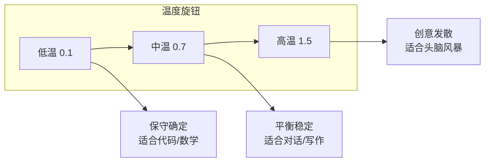
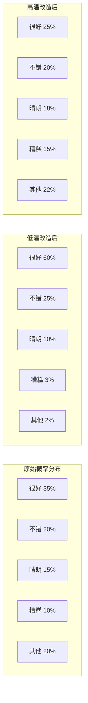
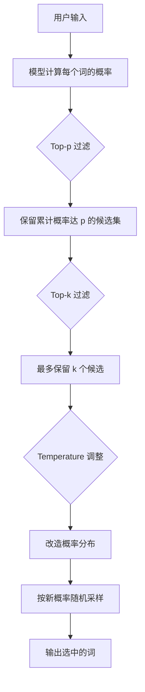

---
tags:
  - AI 基础
---

# 温度与采样参数

你有没有发现：同样问 AI 一个问题，有时它回答得中规中矩，有时却天马行空？

这背后的"幕后黑手"，就是**温度（Temperature）**和**采样参数**。它们是控制 LLM 输出"随机性"的旋钮——拧松一点，AI 变得更有创意；拧紧一点，AI 变得更保守、更确定。

理解这些参数，你就掌握了让 AI "听话"或"放飞"的遥控器。

## 这章解决什么问题

当你调用 LLM 的 API 时，常常会看到几个让人困惑的参数：

- `temperature=0.7` 是什么意思？调高调低有什么区别？
- `top_p` 和 `top_k` 又是什么？
- 写代码和写小说，应该用同一个温度吗？

这章帮你搞清楚：LLM 是怎么"决定"下一个词说什么的，以及你如何通过参数控制这个过程。

## LLM 是怎么"选词"的

在讲参数之前，先理解 LLM 生成文本的核心动作：**预测下一个词**。

你输入一句话，模型会算出所有可能接在后面的词，以及每个词的概率。比如输入"今天天气"，模型可能算出：

| 候选词 | 概率 |
| --- | --- |
| 很好 | 35% |
| 不错 | 20% |
| 晴朗 | 15% |
| 糟糕 | 10% |
| 像 | 5% |
| 紫色 | 0.001% |

如果每次都选概率最高的词，模型会变得非常"死板"——同样的输入永远得到同样的输出，没有任何变化。这就像一个只会背标准答案的学生。

**采样（Sampling）** 就是用来打破这种死板的机制。模型不是直接选概率最高的词，而是**从候选池里按概率随机抽取**。概率高的词更容易被选中，但概率低的词也有机会"爆冷"。

温度、top-p、top-k，就是三种控制"随机抽取规则"的参数。

## Temperature：控制"创意程度"的旋钮

**Temperature（温度）** 是最直观的采样参数。它的取值范围通常是 0 到 2（有些模型支持更高）。

### 低温：保守、确定、可预测

当温度接近 0 时，模型几乎总是选概率最高的那个词。输出非常稳定，同样的输入几乎得到同样的回答。

**适合场景**：

- 代码生成（你不想让 AI "创意"地改你的函数名）
- 事实问答（需要稳定、一致的答案）
- 数学计算（确定性越高越好）
- 格式化输出（比如生成 JSON，结构必须稳定）

```
temperature = 0.1 ~ 0.3
```

### 中温：平衡创意与一致

温度在 0.5~0.7 之间时，模型会在"大概率词"和"小概率词"之间做一个平衡。输出既有一定变化，又不会太离谱。

**适合场景**：

- 一般对话
- 写作辅助
- 内容总结
- 翻译

```
temperature = 0.5 ~ 0.7
```

### 高温：发散、创意、不可预测

温度超过 0.8 时，小概率词被抽中的机会大幅增加。模型的回答会变得更有创意、更多样，但也更容易"跑偏"——可能突然换一个话题，或者生成一些奇怪的搭配。

**适合场景**：

- 头脑风暴
- 创意写作（小说、诗歌、广告文案）
- 角色扮演
- 探索多种可能性

```
temperature = 0.8 ~ 1.2
```

### 一个直观的比喻

把 Temperature 想象成一个**调音台上的"创意旋钮"**：



- 低温 = 古典音乐厅：每个音符都按谱子来，不会有意外
- 中温 = 爵士酒吧：有一定即兴，但整体在调上
- 高温 = 自由即兴 jam session：可能很精彩，也可能完全跑调

### 温度对概率分布的影响

温度本质上是在**改造概率分布的形状**：



低温会让概率分布更"尖锐"——头部词的概率更高，尾部词更不容易被选中。高温会让分布更"平坦"——各个词的概率差距缩小，小众词也有机会出头。

## Top-k 和 Top-p：另一种控制方式

除了 Temperature，还有两种常用的采样策略。

### Top-k：只从前 k 个候选里选

**Top-k** 的思路很直接：不管概率多低，我只保留概率最高的 k 个词，其他的直接扔掉。然后从这 k 个词里按概率随机抽。

比如 `top_k = 5`：

| 原始候选 | 概率 | 是否保留 |
| --- | --- | --- |
| 很好 | 35% | ✓ |
| 不错 | 20% | ✓ |
| 晴朗 | 15% | ✓ |
| 糟糕 | 10% | ✓ |
| 像 | 5% | ✓ |
| 紫色 | 0.001% | ✗ 扔掉 |

好处是简单直接，不会选中那些极其离谱的词。坏处是 k 值不好定——有些场景前 5 个候选就够用了，有些场景可能需要前 50 个。

### Top-p（Nucleus Sampling）：从累计概率达标的最小集合里选

**Top-p** 更智能一些。它不是固定保留 k 个词，而是按概率从高到低排序，一直累加，直到累计概率达到 p 为止。

比如 `top_p = 0.9`：

1. "很好" 35% → 累计 35%，不够 90%，继续
2. "不错" 20% → 累计 55%，不够 90%，继续
3. "晴朗" 15% → 累计 70%，不够 90%，继续
4. "糟糕" 10% → 累计 80%，不够 90%，继续
5. "像" 5% → 累计 85%，不够 90%，继续
6. "紫色" 0.001% → ... 可能需要更多词才能达到 90%

最终保留的词数不固定，但保证这些词的累计概率达到了你设定的阈值。这种方法自适应地调整候选池大小，比固定的 top-k 更灵活。

### 三种参数的关系



在实际使用中，这三个参数通常**组合使用**。常见做法：

| 场景 | Temperature | Top-p | Top-k |
| --- | --- | --- | --- |
| 代码生成 | 0.1 ~ 0.3 | 0.1 ~ 0.5 | 1 ~ 5 |
| 事实问答 | 0.1 ~ 0.3 | 0.5 | 5 ~ 10 |
| 一般对话 | 0.5 ~ 0.7 | 0.9 | 40 ~ 50 |
| 创意写作 | 0.8 ~ 1.2 | 0.95 | 50 ~ 100 |
| 头脑风暴 | 1.0 ~ 1.5 | 0.99 | 100+ |

> 💡 注意：不同 API 的默认值不同。OpenAI 的 GPT 默认 temperature=1，Anthropic 的 Claude 默认 temperature=1。调用前最好确认一下默认值，避免意外。

## 最小示例：感受温度的差异

用同一个提示词，在不同温度下问 LLM，你会明显感受到风格差异。

**提示词**：
```
用一句话描述秋天。
```

**temperature = 0.1**（几乎确定性输出）：
> 秋天是四季之一，天气逐渐转凉，树叶变黄并落下。

**temperature = 0.7**（平衡风格）：
> 秋天像一位温柔的画家，把山林染成金黄和火红，空气中飘着桂花的香气。

**temperature = 1.5**（高度发散）：
> 秋天是宇宙派来的魔术师，它把阳光剪成碎片撒进河流，让落叶跳起华尔兹，连风都在低声朗诵一首关于离别的十四行诗。

同一个问题，三个温度给出三种完全不同的调性。低温像百科全书，中温像散文，高温像现代诗。

## 常见误区

**误区 1：Temperature = 智能程度**

不对。温度只控制随机性，不控制模型的"聪明程度"。一个温度为 0 的 GPT-4 和一个温度为 1 的 GPT-4，底层模型一模一样，只是输出风格不同。低温的回答可能更"安全"但缺乏新意，高温的回答可能更有创意但也更可能出错。

**误区 2：温度越高，回答越好**

看场景。写小说时高温可能更好，写代码时高温就是灾难。没有"最好的温度"，只有"最适合当前任务的温度"。

**误区 3：所有任务都用默认温度**

很多新手从来不调 temperature，直接用 API 默认值。这没问题，但如果你发现 AI 的回答太"滑头"或太"死板"，第一个该调的参数就是温度。

**误区 4：Temperature = 0 时输出永远一样**

理论上接近 0 时应该一样，但有些模型在实现上会有微小随机性（比如浮点精度问题）。如果你需要 100% 确定性的输出，有些 API 提供了 `seed` 参数来固定随机种子。

**误区 5：Top-p 和 Top-k 是互斥的**

不是。它们可以一起用。通常的做法是：先让 top-p 做一轮粗筛，再用 top-k 限制候选数量，最后用 temperature 调整概率分布。大多数 API 会自动帮你处理好这个组合逻辑。

## 延伸阅读

- [什么是 LLM](what-is-llm.md) —— 了解大语言模型"预测下一个词"的核心机制
- [Token、Embedding 与上下文窗口](token-embedding-context.md) —— 了解模型怎么处理你输入的文字
- [Prompt 工程入门](../prompt/index.md) —— 学会怎么写好提示词，配合合适的温度参数

## 练习题

**实验 1：温度对比实验**

找一个你常用的 AI 对话产品（如果支持 API 调用更好），用同一个提示词，分别设置 temperature = 0.1、0.7、1.5，各生成 3 次回答。记录：

1. 三个温度下的回答风格差异
2. 同一个温度下，3 次回答是否有变化（温度越低，变化应该越小）
3. 哪个温度最适合这个提示词？

**实验 2：任务-温度匹配**

下面几个任务，你会分别用什么温度？试着给出你的选择，并解释原因：

| 任务 | 你选择的温度 | 理由 |
| --- | --- | --- |
| 让 AI 写一个 Python 函数，计算斐波那契数列 | ? | |
| 让 AI 为新产品起 10 个有创意的名字 | ? | |
| 让 AI 解释"光合作用"的原理 | ? | |
| 让 AI 续写一个悬疑小说的结尾 | ? | |

**思考题**

为什么有些 AI 产品（比如代码助手）在生成代码时温度很低，但在给你写注释或解释时温度会稍高一些？从产品体验的角度思考这个问题。
