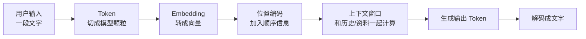
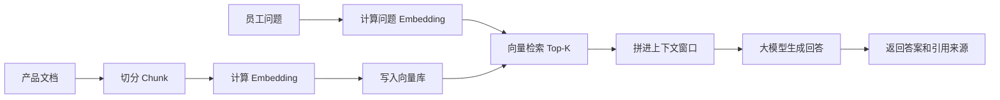

---
tags:
  - AI 基础
---

# Token、Embedding 与上下文窗口

<div markdown="1" style="position:relative;overflow:hidden;border:1px solid rgba(3,169,244,0.30);border-radius:1rem;padding:1.25rem 1.35rem;margin:0.8rem 0 1.5rem;background:linear-gradient(135deg,rgba(3,169,244,0.14),rgba(33,150,243,0.09) 46%,rgba(156,39,176,0.10));box-shadow:0 0.65rem 1.8rem rgba(0,0,0,0.10);">
<div style="position:absolute;right:-3.8rem;top:-4.2rem;width:12rem;height:12rem;border-radius:50%;background:radial-gradient(circle,rgba(3,169,244,0.24),rgba(3,169,244,0));"></div>
<div style="position:absolute;left:-4rem;bottom:-5rem;width:14rem;height:14rem;border-radius:50%;background:radial-gradient(circle,rgba(156,39,176,0.16),rgba(156,39,176,0));"></div>
<div style="position:relative;z-index:1;">
<span style="display:inline-block;padding:0.18rem 0.55rem;border-radius:999px;background:rgba(3,169,244,0.16);color:#01579b;font-size:0.78rem;font-weight:700;letter-spacing:0.02em;">AI 基础 · 第 7 站</span>

<strong>Token</strong>决定模型把文字切成什么颗粒，<strong>Embedding</strong>负责把这些颗粒变成向量，<strong>上下文窗口</strong>规定模型一次能看多少信息。

<div markdown="1" style="display:grid;grid-template-columns:repeat(auto-fit,minmax(9rem,1fr));gap:0.75rem;margin-top:1rem;">
<div style="padding:0.8rem;border-radius:0.75rem;background:var(--md-default-bg-color);border:1px solid var(--md-default-fg-color--lightest);">
<strong>Token</strong><br><span style="color:var(--md-default-fg-color--light);font-size:0.9rem;">文本切块与计费单位</span>
</div>
<div style="padding:0.8rem;border-radius:0.75rem;background:var(--md-default-bg-color);border:1px solid var(--md-default-fg-color--lightest);">
<strong>Embedding</strong><br><span style="color:var(--md-default-fg-color--light);font-size:0.9rem;">语义向量与相似度</span>
</div>
<div style="padding:0.8rem;border-radius:0.75rem;background:var(--md-default-bg-color);border:1px solid var(--md-default-fg-color--lightest);">
<strong>Context</strong><br><span style="color:var(--md-default-fg-color--light);font-size:0.9rem;">输入、历史与输出上限</span>
</div>
</div>
</div>
</div>

> 这一页帮你把「模型怎么看文字」「语义搜索为什么能找近义句」「长上下文为什么也会漏信息」串起来。

## 这章解决什么问题

你给模型发一句：

```text
帮我总结这份会议纪要。
```

看起来只是十来个字。

模型真正收到的流程会复杂很多。它会先把文字切成 token，再把 token 变成数字向量，接着在上下文窗口里和历史对话、系统提示词、工具返回结果一起计算，答案也是一个 token 一个 token 长出来的。

所以新手很快会碰到这些问题：

- 为什么一个中文提示词比想象中更费 token？
- 为什么模型能找出「退款」和「return policy」的关系？
- 为什么知识库问答要把文档切块再建向量索引？
- 为什么 100 万 token 上下文听起来很大，用起来还可能漏掉中间的信息？
- 为什么聊天记录越来越长，模型会变慢、变贵，甚至开始跑偏？

答案基本都藏在三个词里：**Token、Embedding、上下文窗口**。

先看整体链路。

<div markdown="1" style="overflow-x:auto;padding:0.5rem 0 0.8rem;margin:1rem 0;">
<div markdown="1" style="min-width:1180px;">


</div>
</div>

这条链路很短，但会影响价格、速度、记忆、检索和最终效果。

## Token：模型处理文本的颗粒

**Token（词元）**可以先理解成模型处理文本时使用的「文本颗粒」。它可能是一个字、一个词、一个词根、一个标点，也可能是一段字节。

OpenAI Cookbook 在介绍 `tiktoken` 时说，GPT 模型看到的是 token 形式的文本；计算 token 数可以帮助判断文本会不会超过模型上下文长度，也能估算 API 调用成本，因为 API 通常按 token 计费。官方示例里，`tiktoken is great!` 会被切成类似 `t`、`ik`、`token`、` is`、` great`、`!` 这样的片段。[OpenAI Cookbook](https://developers.openai.com/cookbook/examples/how_to_count_tokens_with_tiktoken)

你可以把 tokenizer 想成一把切菜刀。

同一根黄瓜，不同刀法切出来完全不一样。有人切片，有人切丝，有人切滚刀块。文本也一样，同一句话进不同模型，token 数可能差很多。

### 子词切分为什么会出现

早期 NLP 系统常常按词处理文本。问题很快来了：现实语言是开放的，新词、人名、地名、错别字、代码变量名每天都在出现。模型不可能提前把所有词都塞进词表。

2016 年 ACL 论文 [Neural Machine Translation of Rare Words with Subword Units](https://arxiv.org/abs/1508.07909) 讲的就是这个问题。论文指出，神经机器翻译通常使用固定词表，但翻译面对的是开放词表。解决思路是把罕见词和未知词编码成一串 subword units，也就是子词单元。这样一来，完整词没见过，模型仍然可能认识它的组成片段。

比如英文里的 `unbelievable`，可以被拆成 `un`、`bel`、`ievable` 这类片段。模型见过这些片段，就有机会推断这个词的大致用法。

后来又有 [SentencePiece](https://arxiv.org/abs/1808.06226)。它的价值很适合中文读者理解：英文单词之间有空格，中文、日文没有天然空格。SentencePiece 可以直接从原始句子训练 subword 模型，不要求先把文本按词切好，因此对中文、日文这类语言更友好。

<div markdown="1" style="border-left:4px solid #ff7043;padding:0.85rem 1rem;margin:1rem 0;background:rgba(255,112,67,0.08);border-radius:0.55rem;">
<strong>记法：</strong>Token 不是自然语言里的「字」或「词」，它是模型词表和 tokenizer 共同切出来的工程单位。
</div>

### 同一句话，tokenizer 会切出不同结果

OpenAI 的 `tiktoken` 是一个面向 OpenAI 模型的快速 BPE tokenizer。官方仓库说明它支持 `o200k_base`、`cl100k_base` 等编码，也可以通过 `encoding_for_model("gpt-4o")` 按模型名选择编码。[tiktoken GitHub](https://github.com/openai/tiktoken)

OpenAI Cookbook 还给了几个很直观的例子：

| 文本 | encoding | token 数 |
| --- | --- | ---: |
| `antidisestablishmentarianism` | `r50k_base` / `p50k_base` | 5 |
| `antidisestablishmentarianism` | `cl100k_base` / `o200k_base` | 6 |
| `お誕生日おめでとう` | `r50k_base` / `p50k_base` | 14 |
| `お誕生日おめでとう` | `cl100k_base` | 9 |
| `お誕生日おめでとう` | `o200k_base` | 8 |

这说明新 tokenizer 对非英文文本可能更省 token。中文也有类似情况：新模型往往会把更常见的中文词合并成更大的 token，老 tokenizer 可能会拆得更碎。

### Token 会影响三件事

**第一，价格。**

API 计费通常看输入 token 和输出 token。你塞给模型的系统提示词、历史对话、工具结果、用户问题都会算进去。输出越长，也越贵。

**第二，长度。**

上下文窗口按 token 算，不按字数算。一篇 2 万字中文文档到底是多少 token，要用目标模型的 tokenizer 估算，不能靠感觉。

**第三，模型看到的形状。**

如果一个专业词、变量名或混合中英文短语被切得很碎，模型处理起来可能更费劲。代码、URL、表格、日志、乱码、特殊符号，常常会吃掉很多 token。

所以写 Prompt 时，不要只追求文字漂亮。真正要关注的是：信息有没有必要，结构是否清楚，token 有没有浪费。

## Embedding：把语义放进向量空间

计算机不懂「退款」这个词的情绪，也不懂「return policy」是英文客服场景里的常见表达。

它懂数字。

**Embedding（嵌入 / 向量表示）**做的事，就是把文本、图片、音频或其他对象变成一串数字。语义相近的内容，在向量空间里距离更近；语义差很远的内容，距离更远。

OpenAI 的 Embeddings 文档说，text embeddings 用来衡量文本字符串之间的相关性。一个 embedding 是一组浮点数向量，两个向量之间的距离可以衡量文本相关程度。文档列出的用途包括搜索、聚类、推荐、异常检测、分类等。[OpenAI Embeddings 文档](https://developers.openai.com/api/docs/guides/embeddings)

如果说 token 是「切块」，embedding 就是「坐标」。

### 从 word2vec 到句向量

Embedding 这条线并不新。

2013 年，Mikolov 等人的 [word2vec 论文](https://arxiv.org/abs/1301.3781)提出从大规模文本中学习单词的连续向量表示。论文报告称，可以在不到一天的时间里，从 16 亿词规模的数据集中训练出高质量词向量，并且这些向量在语义和句法词相似性测试上表现很好。

早期最让人印象深的例子，是词向量里会出现某些规律：

```text
king - man + woman ≈ queen
```

这个式子不用死记。你只要理解它背后的意思：词语关系有时会在向量空间里表现成方向。

后来的模型开始处理句子级 embedding。[Sentence-BERT](https://arxiv.org/abs/1908.10084) 就是经典工作之一。原始 BERT 做句子相似度时，需要把两个句子一起输入模型，10,000 个句子里找最相似句子对大约要 5,000 万次推理，论文里估算需要约 65 小时。SBERT 通过 Siamese / Triplet 网络生成可直接比较的句子 embedding，用 cosine similarity 比较句子相似度，把这个过程降到约 5 秒，同时保持接近 BERT 的准确率。

这就是 embedding 的价值。

它把「语义像不像」变成了可以计算的问题。

### Embedding 能做什么

常见用途可以这样看：

| 场景 | 怎么用 embedding |
| --- | --- |
| 语义搜索 | 把问题和文档都转成向量，找距离最近的文档 |
| 聚类 | 把相似评论、工单、用户反馈自动归类 |
| 推荐 | 找和用户已读内容相近的文章或商品 |
| 去重 | 找语义重复但文字不同的内容 |
| 分类 | 用文本向量和标签向量的相似度判断类别 |
| RAG | 先检索相关片段，再交给大模型回答 |

RAG 的基础论文 [Retrieval-Augmented Generation for Knowledge-Intensive NLP Tasks](https://arxiv.org/abs/2005.11401) 就把预训练生成模型和外部检索记忆结合起来。论文里，非参数化记忆是 Wikipedia 的 dense vector index，由神经检索器访问。也就是说，文档片段会被编码成 dense vectors，用户问题也会被编码成向量，再在向量索引里找相关内容。

这就是今天很多知识库问答系统的底层套路。

先找，再答。

### 向量库为什么能搜得快

如果有 100 条文档，你可以暴力算一遍相似度。

如果有 1,000 万条呢？

这时就需要向量索引。它的目标是尽量少扫全库，快速找到最可能相似的候选。

[HNSW 论文](https://arxiv.org/abs/1603.09320)提出 Hierarchical Navigable Small World graphs，也就是分层可导航小世界图。它把向量组织成多层图结构，搜索时从高层快速跳到大致区域，再逐层向下做精细搜索。你可以把它想成城市导航：高速路先带你接近目的地，城市道路再把你送到门口。

[FAISS 相关论文 Billion-scale similarity search with GPUs](https://arxiv.org/abs/1702.08734)则展示了 GPU 上的大规模相似度搜索能力。论文强调，图像、视频等复杂数据通常会被表示成高维特征，需要专门的索引结构；它的最近邻实现比此前 GPU 方法快 8.5 倍，还展示了十亿级向量搜索场景。

所以向量数据库的价值很实际：降低延迟，扩大规模，控制成本。

## 上下文窗口：模型一次能看的工作台

**上下文窗口（Context Window）**可以理解成模型一次生成答案时能参考的 token 总容量。

Anthropic 的 Claude 文档把 context window 定义为模型生成响应时可以引用的全部文本，包括当前输入、之前的对话历史，以及模型本轮将要生成的响应本身。也就是说，输入 token 和输出 token 会共享这个窗口。[Anthropic Context Windows 文档](https://platform.claude.com/docs/en/build-with-claude/context-windows)

这点很重要。

如果一个模型支持 128K token，不代表你可以塞满 128K token 输入，再要求它输出一篇很长的报告。输出也要占窗口。

```text
上下文窗口 ≈ 系统提示词 + 历史对话 + 当前输入 + 工具结果 + 本轮输出
```

窗口满了，旧内容就得被截断、压缩、清理，或者请求直接失败。不同模型和 API 行为不完全一样，所以实际开发时要看官方文档。

### Transformer 为什么需要上下文窗口

现代 LLM 大多基于 Transformer。[Attention Is All You Need](https://arxiv.org/abs/1706.03762) 提出的 Transformer 完全基于 attention mechanisms，去掉了循环结构和卷积结构。它的好处是更容易并行化，也能让序列里的 token 通过注意力机制建立关联。

但注意力计算需要处理窗口内 token 之间的关系。窗口越长，计算和显存压力通常越大。

还有一个顺序问题。

Transformer 看到的是一串 token 向量。如果没有位置信息，「猫追狗」和「狗追猫」会变得很难区分。模型必须知道谁在前、谁在后、相隔多远。

位置编码就是干这个的。

[RoPE 论文](https://arxiv.org/abs/2104.09864)提出 Rotary Position Embedding，用旋转方式把位置信息编码进 self-attention，同时体现相对位置关系。[ALiBi 论文](https://arxiv.org/abs/2108.12409)则提出在线性注意力偏置中加入与距离成比例的惩罚，使模型可以在较短序列上训练、在更长序列上测试。论文标题就叫 *Train Short, Test Long*。

这些技术听起来很底层，落到使用体验上，就是你能不能把更长的材料塞进模型。

### 长上下文很强，也有脾气

长上下文模型这几年进步很快。

Google 在 Gemini 1.5 Pro 发布中提到，标准上下文窗口是 128,000 tokens，私有预览中向部分开发者和企业客户开放最高 1 million tokens。官方还说，1.5 Pro 可以处理约 1 小时视频、11 小时音频、超过 30,000 行代码库或超过 700,000 个单词。[Google Gemini 1.5 Pro 发布](https://blog.google/technology/ai/google-gemini-next-generation-model-february-2024/)

听起来很猛。

但窗口大，只说明能放进去更多内容。模型能不能稳定用好里面每一段材料，还要单独看。

[Lost in the Middle](https://arxiv.org/abs/2307.03172) 这篇论文专门研究了这个问题。作者分析了多文档问答和 key-value retrieval 任务，发现相关信息在上下文开头或结尾时，模型表现通常更好；相关信息位于长上下文中间时，性能会明显下降。论文标题里的「Middle」，说的就是这个中间位置。

所以长上下文使用上要克制。

不要把所有资料一股脑塞进去。更稳的做法是：先筛选，再压缩，再排序，把最关键的信息放在更容易被模型用到的位置。

## 三者关系：从文本到回答

Token、Embedding、上下文窗口不是三块孤立知识。它们正好对应模型处理信息的三个层面。

<div markdown="1" style="overflow-x:auto;padding:0.5rem 0 0.8rem;margin:1rem 0;">
<div markdown="1" style="min-width:1180px;">



</div>
</div>

你可以这样记：

| 概念 | 回答的问题 | 影响什么 |
| --- | --- | --- |
| Token | 模型把文本切成什么颗粒 | 价格、长度、切分效果 |
| Embedding | 文本怎样变成可计算的语义 | 搜索、聚类、推荐、RAG |
| 上下文窗口 | 模型一次能参考多少 token | 记忆、长文档、速度、成本 |

再换成开发视角：

```text
想省钱，看 token。
想做搜索，看 embedding。
想处理长材料，看上下文窗口。
```

## 最小示例：做一个公司知识库问答

假设你有 500 份公司产品文档，想让 AI 回答员工问题。

一个常见流程是这样：

<div markdown="1" style="overflow-x:auto;padding:0.5rem 0 0.8rem;margin:1rem 0;">
<div markdown="1" style="min-width:1280px;">



</div>
</div>

这里三个概念都出现了：

- 文档要切成 chunk，每个 chunk 会消耗 token；
- chunk 和问题要计算 embedding，方便语义检索；
- 检索回来的片段要塞进上下文窗口，留给模型生成答案。

如果 chunk 太大，检索不准，还浪费上下文。  
如果 chunk 太小，语义被切碎，模型拿不到完整背景。  
如果检索结果太多，上下文窗口会被填满，模型生成空间变少。

这就是为什么 RAG 看起来只是「上传文档问答」，真正做起来却有一堆工程细节。

## 使用时的经验规则

### 1. 别用字数估 token

字数只能粗略估算。涉及 API 成本、上下文上限、长文档切分时，用目标模型对应 tokenizer 计算。OpenAI 模型可以参考 `tiktoken`，其他模型看各自官方工具。

### 2. 长文档先切块

把整本手册直接塞给模型，成本高，效果也未必稳。更常见的做法是切块、建索引、按问题检索相关片段。

切块时可以先从这些维度试：

| 维度 | 建议 |
| --- | --- |
| 章节边界 | 尽量按标题、段落、列表切，不要硬切断一句话 |
| chunk 大小 | 从几百到一两千 token 试起，看任务调整 |
| overlap | 相邻 chunk 保留少量重叠，避免上下文断裂 |
| 元数据 | 保存标题、来源文件、页码、更新时间 |

### 3. 重要信息放前面或结尾复述

长上下文里，中间材料更容易被忽略。遇到关键规则、约束、输出格式，可以放在开头，并在结尾再短短复述一次。

这不是玄学，是很多长上下文任务里的经验。

### 4. 压缩历史对话

多轮对话会越聊越贵。老历史可以摘要成「当前任务状态」「已确认约束」「待解决问题」，再继续推进。

这样比把所有聊天记录原封不动塞回去更稳。

### 5. Embedding 检索要保留来源

知识库问答最好返回引用来源。模型回答看起来顺，不代表它真的引用了正确片段。保留文件名、章节、页码、URL，后续才能核查。

## 常见误区

??? warning "误区 1：1 个汉字就等于 1 个 token"

    不固定。不同 tokenizer 的切法不同，同一句中文在不同模型里可能消耗不同 token。新 tokenizer 往往对常见中文词更友好，但具体要用工具算。

??? warning "误区 2：Embedding 就是普通编号"

    普通编号只负责区分对象，Embedding 还会编码语义关系。「退款」「退货」「return policy」可能在向量空间里靠得很近，这就是它能做语义搜索的原因。

??? warning "误区 3：向量检索能保证答案正确"

    向量检索只能找相似内容，不能保证找来的内容就是正确答案。文档过期、chunk 切坏、问题表述太模糊、Top-K 设得不合适，都会影响结果。

??? warning "误区 4：上下文窗口越大，效果一定越好"

    大窗口能放更多内容，但也会更慢、更贵，还可能出现中间信息利用不稳的问题。长上下文要配合筛选、排序、摘要和引用核查。

??? warning "误区 5：模型会永久记住当前对话"

    模型只会在当前上下文窗口里参考聊天历史。超出窗口、会话结束、平台没有持久记忆机制时，它不会自然记住之前内容。

??? warning "误区 6：把公司资料丢给模型就等于训练了模型"

    大多数知识库问答只是推理时检索资料，再把资料放进上下文。模型参数没有被更新。真正训练或微调，需要另一套数据、算力和流程。

## 使用和开发时的安全边界

1. **不要把敏感文档直接拿去试不明工具。** Tokenizer、Embedding API、向量库、RAG 平台都可能接触原文或向量，合同、源代码、客户信息要先看清服务条款。
2. **Embedding 也可能泄露信息。** 向量不是原文，但可能暴露语义特征。高敏数据要做访问控制和隔离存储。
3. **知识库要保留权限。** 员工不能看的文档，RAG 检索时也不能被召回。向量库同样要做权限过滤。
4. **长上下文不要混入无关资料。** 无关内容会消耗 token，也可能干扰答案。
5. **高风险场景要给来源。** 法务、财务、医疗、安全、运维变更这类场景，回答必须能追到原始资料。

## 练习题 / 小实验

??? question "练习 1：观察 token 切分"

    找一个 tokenizer 工具，分别输入：

    ```text
    你好世界
    unbelievable
    深度学习
    user_id=12345&debug=true
    ```

    观察中文、英文、代码参数分别会被切成多少 token。

    ??? done "参考思路"

        你会发现 token 和字数没有固定换算关系。代码、符号、混合中英文经常会出现比较碎的切分。真实项目里要用目标模型 tokenizer 估算，别靠肉眼猜。

??? question "练习 2：判断该用关键词搜索还是向量搜索"

    下面两个需求，哪个更适合向量搜索？

    - 查找所有包含「退款」两个字的客服记录；
    - 查找和「用户想取消订单并拿回钱」意思相近的客服记录。

    ??? done "参考思路"

        第一个更适合关键词搜索。第二个更适合向量搜索，因为用户可能写「退钱」「取消购买」「return policy」「不要了能不能返钱」。Embedding 可以捕捉这些语义相近表达。

??? question "练习 3：设计一个小型 RAG 流程"

    你有 100 页产品说明书，想让模型回答售后问题。请写出最小流程。

    ??? done "参考思路"

        可以这样设计：按章节切块 → 每块计算 embedding → 存入向量库并保留标题和页码 → 用户问题计算 embedding → 检索 Top-K 片段 → 把片段和问题放进上下文 → 要求模型只基于片段回答并给出处。

??? question "练习 4：处理超长材料"

    你要让模型分析一本 20 万字的手册，但模型上下文窗口装不下。你会怎么做？

    ??? done "参考思路"

        先按章节切分，做摘要和索引；针对问题检索相关章节；必要时分批分析，再合并结论。不要一次性塞满上下文窗口。

## 下一步

<div markdown="1" style="border:1px solid var(--md-default-fg-color--lightest);border-left:4px solid var(--md-accent-fg-color);border-radius:0.85rem;padding:1rem 1.1rem;margin:0.9rem 0;background:linear-gradient(135deg,var(--md-code-bg-color),rgba(255,112,67,0.06));">

理解了 Token、Embedding 和上下文窗口之后，下一站建议看：

<a href="../prompt-context-memory/" style="display:block;margin-top:0.75rem;padding:0.85rem 1rem;border-radius:0.65rem;background:var(--md-default-bg-color);text-decoration:none;border:1px solid var(--md-default-fg-color--lightest);">
  <strong>Prompt、上下文和记忆 →</strong><br>
  <span style="color:var(--md-default-fg-color--light);font-size:0.92rem;">继续理解 Prompt 怎样组织上下文，模型记忆和聊天历史到底有什么区别。</span>
</a>

</div>
