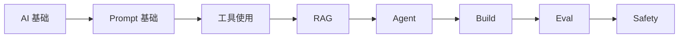

# Hello-AI

> **如果你打开过十个 AI 教程，大概也合上过十个。**
>
> 你大概率不笨。问题出在 AI 资料太多、顺序太乱、术语太密。Hello-AI 想做的事很简单：把零散的优质资料串成一条中文学习路径，让你从「我大概听过 AI」走到「我能自己跑通一个小项目」。

[为什么学 AI →](preface/why.md){ .md-button .md-button--primary }
[先看学习路线](preface/roadmap.md){ .md-button }

## 从哪开始

- **完全没碰过** — 先去[为什么学 AI](preface/why.md)，搞清楚跟我有什么关系。
- **想先看清整条路** — 翻一下[学习路线](preface/roadmap.md)，知道每个阶段大概要花多久。
- **准备开始动手** — 直接进[AI 基础](basics/index.md)，把后面写代码用得到的概念先垫一层。

不知道选哪个就选第一个。那一页只讲一件事：这件事跟你有什么关系。

## 为什么要有这条路

Prompt、RAG、Agent、微调、评测、安全，每个词单看都有几十篇文章，可谁先谁后、谁依赖谁，基本没人给你捋过一遍。大部分教程讲完原理就结束了，下一步怎么动手，基本没人管你。中文资料这块更明显，国外项目质量很高，但要么偏研究、要么偏深度，跟工程师和爱好者的真实工作场景对不上。

Hello-AI 的做法是不押单一工具，押能力本身。读懂模型、写好 Prompt、搭出 RAG、跑通 Agent、知道怎么评测和上线。每一章后面都会落到一件「你今天能做出来」的事，不会读完一篇长文然后留你对着 API 文档发呆。

我也踩过同样的坑：先囤了几十 G 的网课，再被「先学线代还是先学 Python」反复劝退，最后是被一次真实需求逼出来的 — 公司要做个内部知识库，老板下周要看 demo。走到那一步才明白：**AI 入门，其实就缺一个人把零散的资料按顺序串成一条路。**

## 走完一遍你能做出什么

你会做出一个喂了自己资料的问答助手，把笔记、PDF、公司文档塞进去，问它「上周那份周报里提到的预算是多少」，它能给出带出处的回答。你会搭出一个会自己干活的小 Agent，给它一个周期任务，它能拆任务、调工具、跑完，不会只在聊天框里说「建议你」。你还会攒出一套可复用的 Prompt 模板库，调指令不再凭感觉。

更值钱的是判断力。看到新模型发布、新框架开源，你能判断它解决了什么旧问题，要不要追。这些做出来，能丢到简历里、能在团队周会上演示、能解决一个真问题。

## 路线长什么样

从 AI 基础出发，先搞懂概念，再学会提问，然后让模型接上你自己的资料、自己拆任务，最后拼成项目，回头检查准不准、稳不稳、安不安全。具体每一站讲什么、不同背景怎么跳着走，去看[学习路线](preface/roadmap.md)。

## 这站适合谁

工程师、大学生、被指定负责 AI 的人、内容创作者、周末想搭聊天机器人的爱好者，都适合。这站不追热点、不堆术语、不搞速通，能用大白话讲清楚的就不写公式，能落到项目的就不留空谈。没写完的地方直接说没写完，lint 报告和 commit 历史都摆出来。

## 先戳破几个常见误区

- **学 AI 要先学完线代 / 概率论 / Python 全套。** 用 AI 写应用，所需数学比你想的少太多。缺啥补啥比一次学完高效十倍。
- **等模型再迭代一轮我再学。** 底层 API 调用、Prompt、RAG、Agent 这层抽象已经稳定了一年多，等下去只会更落后。
- **LangChain / LlamaIndex 必须二选一。** 先用原生 SDK 跑一遍，你会发现框架只省了几行代码，代价却是一整个黑盒。
- **微调比 RAG 高级。** 90% 的场景下，先把 Prompt 和 RAG 做好再考虑微调，省时省钱效果还更好。
- **我不是程序员，学不了。** Chat 类产品不需要写代码。API 调用阶段有 AI 帮忙，门槛比你想象的低很多。

更多顾虑去[常见顾虑](preface/faq.md)看看。

---

> **开始容易，把第一条路走完才难。**
>
> 这条路我自己趟过一遍，每一步踩在哪都写下来了。你不用从零开始。

[准备好了，从为什么学 AI 开始 →](preface/why.md){ .md-button .md-button--primary }
