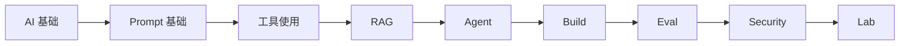

# 学习路线

Hello-AI 建议按下面顺序学习：

```mermaid
flowchart LR
    A[AI 基础] --> B[Prompt 基础]
    B --> C[工具使用]
    C --> D[RAG]
    D --> E[Agent]
    E --> F[Build]
    F --> G[Eval]
    G --> H[Security]
    H --> I[Lab]
```

## 新手线

- AI 是什么
- LLM 是什么
- 怎么提问
- 怎么看输出

## 实战线

- API 调用
- RAG 小项目
- Agent 小项目
- 本地部署

## 进阶线

- 评测
- 安全
- 工作流
- 项目化落地
