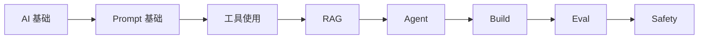

# 学习路线

前言 · 第 2 站

学 AI 最怕的是乱。搜「AI 学习路线」能搜出几十张图，每张长得都不一样。这一页告诉你 Hello-AI 的结构是什么、不同背景怎么走、每步大概花多久。

---

## 一张图看懂全貌

每一步都建立在上一步的基础上。跳太多省下来的时间，后面都会还回来。

我见过不少人一上来就想搞 Agent，连 Prompt 都没写明白，结果调了三天连个基础对话都跑不通。也见过有人直接冲 RAG，连 Embedding 是什么都不知道，报错看了一脸懵。这些坑，按顺序走基本都能避开。

---

## 不同背景，不同入口

零基础 · 约 2-3 周

从头走，别跳。

1. [什么是 AI](../basics/what-is-ai.md) — 先知道这张地图有多大
2. [什么是 LLM](../basics/what-is-llm.md) — 理解聊天模型怎么生成文字
3. [Prompt 基础](../prompt/prompt-basic.md) — 学会怎么跟模型说人话
4. [Chat 类产品怎么用](../tools/chat-products.md) — 把学到的东西用起来

这四篇是最小起步单元。读完你就能跟 AI 有效对话了。

我自己走过这条路。前三篇大概花两天，Chat 类产品那篇花一天上手试。加起来三天，每天大概两小时。

---

有编程基础 · 约 1-2 周

可以跳过 AI 基础前三篇，直接从 LLM 开始。

1. [什么是 LLM](../basics/what-is-llm.md) — 快速补上模型侧的知识
2. [API 入门](../tools/api.md) — 开始写代码调模型
3. [RAG](../rag/index.md) — 给模型接上你自己的资料
4. [Agent](../agent/index.md) — 让模型自己拆任务、调工具

API 入门那篇你可能半小时就过完了，RAG 和 Agent 才是真正花时间的地方。

---

想快速做项目 · 约 1 周

两三天速读基础概念，然后直接进实战。

1. 速读 [AI 基础](../basics/index.md) 里的「如果时间有限」四篇
2. 直接进 [Build 实战](../build/index.md)
3. 挑一个 [Lab](../lab/index.md) 动手做

走完这条线你手里会有一个能跑的小项目。去年 Vibe Coding 出来之后，有博主实测零基础一周做出了三个小工具。

你完全可以按自己的节奏来，慢一点没关系，关键是每篇都动手试一下。

---

## 每个阶段大概要多久

| 阶段 | 内容 | 零基础 | 有基础 |
|---|---|---|---|
| AI 基础 | 什么是 AI 到幻觉，共 10 篇 | 5-7 天 | 1-2 天速读 |
| Prompt | 从基础到失败案例，共 6 篇 | 3-4 天 | 1-2 天 |
| 工具使用 | Chat、API、工具调用，共 6 篇 | 3-4 天 | 2-3 天 |
| RAG | 从原理到实战，共 7 篇 | 5-7 天 | 3-4 天 |
| Agent | 从概念到失败模式，共 5 篇 | 4-5 天 | 2-3 天 |
| Build | API 接入到部署，共 5 篇 | 5-7 天 | 3-4 天 |
| Eval + Safety | 评测和安全，共 8 篇 | 4-5 天 | 2-3 天 |

这些是每天花 1-2 小时的估算。你完全可以按自己的节奏来，不用赶进度。

有人学得快，有人学得慢，这都很正常。关键是你每天都在往前走，哪怕只读一篇、只改一行 Prompt，积累下来效果比「攒一周突击看」好得多。

---

## 几个常见的坑

我踩过的，或者看别人踩过的，提前说一下。

坑一 <strong>死磕理论不动手</strong> 有人把 AI 基础 10 篇全看完才开始写 Prompt，结果看完前面忘后面。看一篇就试一篇。

坑二 <strong>工具贪多</strong> 每个都装一遍，每个都浅尝辄止。先把一个用熟，再换下一个。

坑三 <strong>跳过基础冲 Agent</strong> 连 Prompt 都没写明白就想搭 Agent，调了三天连基础对话都跑不通。

坑四 <strong>追求完美架构</strong> 选数据库选两天，选框架选三天，代码一行没写。先跑起来，后面再优化。

---

## 遇到看不懂的怎么办

<strong>先记下来，往后翻三章。</strong> 很多概念在更后面会自己变清楚。如果翻了三章还是卡着，回去看对应的 AI 基础章节，那里有详细解释。

<strong>每章至少动一次手。</strong> 哪怕只是改一行 Prompt、跑一次脚本，比读十遍都强。光看不练，下次遇到还是不会。

<strong>别怕问。</strong> 遇到卡住的地方，在 Hello-AI 的 GitHub 上提 Issue，或者找社区里的人聊聊。学 AI 这件事，一个人硬扛效率最低。

---

## 准备好了？

[从 AI 基础开始 →](../basics/what-is-ai.md){ .md-button .md-button--primary }
[先看常见顾虑](faq.md){ .md-button }
