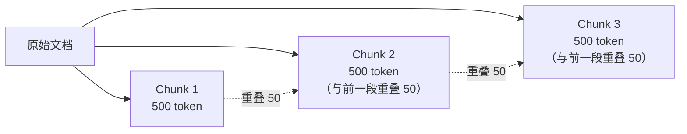

---
tags:
  - RAG
---

# 文档切分

> 文档切分（Chunking）是把长文本切成小片段的过程——切得好，检索才能找得准；切得不好，后面的所有优化都救不回来。

## 这章解决什么问题

想象你要从一本 500 页的说明书里找到「保修期限」那一段。如果说明书被撕成了几百张纸条，每张只有一句话——你可能找不到完整的上下文。如果每张纸条是一整章——那你要的信息又和其他内容混在一起，不够精确。

**文档切分就是找这个「平衡点」**：让每个片段足够小，能精确匹配用户问题；又足够大，包含完整的上下文信息。

这是 RAG 系统里最重要的优化点之一。原因很简单：后续的检索、重排、生成都是建立在这些片段之上的。**切分策略直接决定了检索质量的上限。**

## 核心概念

### 切分粒度

切分的「粗细」直接影响检索效果：

| 粒度 | 典型大小 | 优点 | 缺点 |
|------|---------|------|------|
| **粗粒度** | 按章节或段落 | 上下文完整，不会切断关键语句 | 可能包含无关信息，检索精度下降 |
| **中粒度** | 固定字符数（如 300~500） | 统一，便于批量处理 | 可能从句子中间切断 |
| **细粒度** | 按句子或语义段落 | 精确匹配用户问题 | 缺少上下文，信息可能不完整 |

没有绝对正确的粒度，取决于你的文档类型和用户提问方式。一般建议从 300~500 个 token 开始，根据检索效果调整。

### 常见的切分策略

**策略 1：固定长度切分**

这是最简单的方案，按字符数或 Token 数硬切：

```python
def fixed_length_chunk(text, chunk_size=500, overlap=50):
    """按固定字符数切分，带重叠"""
    chunks = []
    start = 0
    while start < len(text):
        end = start + chunk_size
        chunks.append(text[start:end])
        start = end - overlap  # 前一个片段的尾部与后一个片段的头部重叠
    return chunks
```

- 优点：实现简单，性能好
- 缺点：可能从句子中间切断，丢失语义

**策略 2：递归字符切分（Recursive Character Splitter）**

LangChain 的 `RecursiveCharacterTextSplitter` 是最常用的方案。它按优先级依次尝试分隔符：`\n\n`（段落） → `\n`（换行） → `。`（句号） → ` `（空格），尽可能在语义边界处切分：

```python
from langchain.text_splitter import RecursiveCharacterTextSplitter

text = """
# 第一章：RAG 简介

RAG 是检索增强生成。它通过检索外部知识来辅助生成。

## 核心组件

RAG 包含三个核心组件：检索器、生成器、知识库。

### 检索器

检索器负责根据用户问题找到最相关的文档片段。
"""

splitter = RecursiveCharacterTextSplitter(
    chunk_size=100,
    chunk_overlap=20,
    separators=["\n\n", "\n", "。", " ", ""],
)

chunks = splitter.split_text(text)
for i, chunk in enumerate(chunks):
    print(f"--- Chunk {i+1} ({len(chunk)} 字符) ---")
    print(chunk)
```

**策略 3：语义切分（Semantic Chunking）**

利用 Embedding 模型探测段落之间的语义边界。当相邻几个句子的向量相似度有明显下降时，说明话题切换了，在此处切分：

```python
from langchain_experimental.text_splitter import SemanticChunker
from langchain_openai.embeddings import OpenAIEmbeddings

splitter = SemanticChunker(
    OpenAIEmbeddings(model="text-embedding-3-small"),
    breakpoint_threshold_type="percentile"
)
chunks = splitter.split_text(document)
```

**策略 4：按文档结构切分**

对于有固定结构的文档（Markdown、HTML、代码），按标题层级切分最自然：

```python
from langchain.text_splitter import MarkdownHeaderTextSplitter

headers_to_split_on = [
    ("#", "H1"),
    ("##", "H2"),
    ("###", "H3"),
]
splitter = MarkdownHeaderTextSplitter(headers_to_split_on)
chunks = splitter.split_text(markdown_document)
```

这种方式保证每个 chunk 在语义上是一个完整的「小节」，最适合结构化文档。

### 重叠策略（Overlap）

切分时让相邻片段有一部分重叠，避免关键信息恰好在切分边界处丢失：



- 重叠大小通常设为 chunk 大小的 **10%~20%**
- 重叠太少：边界信息仍有丢失风险
- 重叠太多：索引体积增大，检索时重复内容增多，浪费上下文窗口

### Chunk 大小怎么定

chunk 大小没有一个标准值，但有一些经验参考：

| 文档类型 | 建议 chunk 大小（token） | 理由 |
|---------|------------------------|------|
| 新闻文章 | 200~400 | 每段信息密度高，不宜太大 |
| 技术文档 | 300~500 | 需要保留完整的技术说明 |
| 学术论文 | 500~1000 | 摘要/方法/结论各成独立 chunk |
| 代码文件 | 按函数或类切 | 代码的逻辑单元是函数 |
| 对话记录 | 按轮次切 | 一问一答是一个语义单元 |

最可靠的方案是做 A/B 测试：准备一组典型问题，分别用不同 chunk 大小检索，对比召回率。

## 最小示例

以下代码演示如何评估不同切分策略的效果：

```python
import openai
import numpy as np

# 原始文档
document = """
# RAG 入门指南

## 什么是 RAG

RAG（检索增强生成）是一种让 LLM 先查资料再回答的技术。

## 为什么需要 RAG

LLM 不知道你的私有数据，RAG 通过检索来解决这个问题。

## 核心组件

一个 RAG 系统由检索器、知识库和生成器三部分组成。
"""

# 尝试不同的切分策略
from langchain.text_splitter import (
    RecursiveCharacterTextSplitter,
    MarkdownHeaderTextSplitter,
)

# 策略 A：递归字符切分
r_splitter = RecursiveCharacterTextSplitter(
    chunk_size=50, chunk_overlap=10
)
chunks_a = r_splitter.split_text(document)

# 策略 B：按标题切分
h_splitter = MarkdownHeaderTextSplitter([
    ("#", "H1"), ("##", "H2")
])
chunks_b = h_splitter.split_text(document)

print("策略 A 结果：")
for i, c in enumerate(chunks_a):
    print(f"  [{i}] {c[:40]}...")

print("\n策略 B 结果：")
for i, c in enumerate(chunks_b):
    print(f"  [{i}] {c.page_content[:40]}...")
```

## 常见误区

!!! failure "误区 1：chunk 越大越好"
    chunk 越大，语义越完整，但检索精度越低。太大的 chunk 导致很多不相关的内容一起被搜到，LLM 会被噪声干扰。建议从 300~500 token 开始测试。

!!! failure "误区 2：所有文档用同一种切分策略"
    Markdown 文档适合按标题切，法律合同适合按条款切，代码适合按函数切。一刀切的策略往往效果最差。

!!! failure "误区 3：切完就不管了"
    切分策略需要持续调试。建议定期采样检查 chunk 是否语义完整，用典型问题测试检索效果，根据实际反馈调整参数。

## 延伸阅读

- [向量化](vectorization.md) —— 切分后的文本如何变成向量
- [检索](retrieval.md) —— 切分质量直接影响检索效果
- [RAG 常见问题](troubleshooting.md)

## 练习题

??? question "练习 1：评估不同切分策略"

    找一篇 2000 字以上的文章（比如维基百科条目），用以下三种方式各切一次，并回答后续问题：

    ```
    - 方式 A：每 200 字符固定长度，无重叠
    - 方式 B：每 200 字符，50 字符重叠
    - 方式 C：按段落（\n\n 分隔符）
    ```

    对每种方式随机挑 3 个 chunk，判断：

    1. 这个 chunk 的语义是否完整？有没有被切断的句子？
    2. 如果拿这个 chunk 去回答相关问题，信息够用吗？
    3. 哪种方式产生的 chunks 整体质量最高？

??? question "练习 2：给不同文档选策略"

    假设你需要为以下三类文档设计切分策略：

    - 一本编程书籍（Markdown 格式，有标题层级）
    - 一年的客服对话记录（每段对话以时间戳开头）
    - 一份法律合同（没有标题，但有条款编号 1.1, 1.2...）

    对每类文档，你会选择哪种切分策略？为什么？
