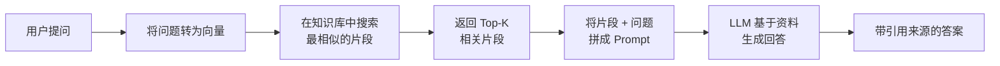

---
tags:
  - RAG
---

# RAG 总览

> RAG（Retrieval-Augmented Generation，检索增强生成）是一种让大语言模型先查资料再回答的技术架构。它不是某个具体的产品，而是一套解决问题的思路。

## 这章解决什么问题

假设你是一家公司的技术支持，每天需要回答客户关于产品使用的问题。你的知识库里有完整的用户手册，但你不能把整本手册塞进聊天框。

你试过直接问 ChatGPT，但它的回答要么太通用（不知道你的产品细节），要么直接编造。你也想过把所有文档喂给模型，但上下文窗口放不下，而且用户只想知道某一个功能怎么用，不需要整本手册。

RAG 就是来解决这个矛盾的：**不让模型凭记忆回答，而是先从一个知识库里找到相关的几段资料，再让模型基于这些资料来组织答案。**



这章是 RAG 模块的入口。读完这章，你会知道：

- RAG 解决什么问题、不能解决什么问题
- 一个完整 RAG 系统由哪些环节组成
- 每个环节之间的关系和常见坑
- 学完本模块后你应该能做什么

## 核心概念

### 什么是 RAG

RAG 是 **Retrieval-Augmented Generation** 的缩写，中文叫**检索增强生成**。名字本身就是它的工作原理拆解：

| 环节 | 英文 | 做什么 |
|------|------|--------|
| **检索** | Retrieval | 从知识库里找到与问题最相关的文档片段 |
| **增强** | Augmented | 把检索到的资料作为额外信息拼入 Prompt |
| **生成** | Generation | LLM 基于原始问题 + 检索资料生成最终答案 |

这三个环节缺一不可。没有检索，模型只能凭训练数据回答（不知道你的私有数据）；没有增强，检索结果的利用率低；没有生成，你得到的是原文片段而不是答案。

### 一个 RAG 系统的五步流程

!!! note "RAG 的标准流程"
    1. **文档切分（Chunking）**：把长文档切成合适大小的片段
    2. **向量化（Vectorization）**：用 Embedding 模型把文本片段转成向量，存入向量数据库
    3. **检索（Retrieval）**：用户提问时，把问题也转成向量，在数据库中找最相似的前 K 条
    4. **重排（Rerank）**：用更精确的模型对检索结果重新排序，把最相关的排前面
    5. **生成（Generation）**：把问题 + 精选后的资料拼成 Prompt，交给 LLM 生成答案

每个步骤都有独立的优化空间。切分的粒度影响检索精度，Embedding 模型的选择影响语义匹配质量，重排决定最终给 LLM 的资料质量，Prompt 设计影响最终答案的可读性和准确性。

### RAG vs 直接问 LLM vs 微调

新手最容易混淆这三者的区别。我们用一个具体场景来说明：

> 场景：你是某 SaaS 公司的客服，用户问「我们的年付套餐能退款吗？」

| 方式 | 过程 | 结果 |
|------|------|------|
| **直接问 LLM** | 模型凭训练数据回答 | 可能说「一般可以退款」，但你们公司的政策是「年付超过 30 天不退」 |
| **RAG** | 先从公司知识库检索退款政策 → 再把政策原文给 LLM → LLM 据此回答 | 「年付套餐购买后 30 天内可全额退款，超过 30 天按剩余天数比例折算」+ 来源标注 |
| **微调（Fine-tuning）** | 用公司历史客服对话训练模型 | 模型学会了回复风格和专业术语，但新政策的更新需要重新训练 |

| 维度 | 直接问 LLM | RAG | 微调 |
|------|-----------|-----|------|
| 引入新知识 | ❌ 训练后才知 | ✅ 更新知识库即可 | ❌ 需重新训练 |
| 知识透明度 | ❌ 黑盒 | ✅ 可追溯来源 | ❌ 知识嵌入参数 |
| 维护成本 | 低 | 中（维护知识库） | 高（训练 + 部署） |
| 适合场景 | 常识问答、翻译、创意 | 知识问答、客服、文档解读 | 格式转换、风格迁移、分类 |
| 延迟 | 最低 | 中（多一次检索） | 低 |

## RAG 模块的学习路径

本模块共 8 页，建议按以下顺序阅读：

```
RAG 总览（当前页）
  └→ 为什么需要 RAG —— 理解 RAG 的适用场景和边界
      └→ 文档切分 —— 切得好，检索才能找得准
          └→ 向量化 —— 把文本变成向量
              └→ 检索 —— 在向量库中找最相关的片段
                  └→ 重排 —— 对初步结果做精细排序
                      └→ 生成 —— LLM 根据资料组织答案
                          └→ RAG 常见问题 —— 调试与故障排查
```

如果你时间有限，优先读：为什么需要 RAG → 文档切分 → 检索 → 生成。这四页覆盖了 RAG 的核心决策点。

## 最小示例

以下代码演示了一个极简 RAG 流程。它不做重排、不连外部向量数据库，但能让你直观感受「检索 → 增强 → 生成」的完整链路：

```python
import openai
import numpy as np

# ── 1. 准备知识库片段 ──
chunks = [
    "RAG 是 Retrieval-Augmented Generation 的缩写，中文叫检索增强生成。",
    "文档切分（Chunking）是把长文本切成小片段的过程。",
    "向量化（Vectorization）是把文本转换成数值向量的过程。",
    "检索（Retrieval）是通过向量相似度找到相关文本片段。",
    "重排（Rerank）是对检索结果做二次排序，提高精度。",
    "生成（Generation）是 LLM 基于资料组织最终答案。",
]

# ── 2. 向量化：将文本转为向量 ──
response = openai.embeddings.create(
    model="text-embedding-3-small", input=chunks
)
chunk_vectors = np.array([d.embedding for d in response.data])

# ── 3. 检索：找与问题最相似的片段 ──
query = "RAG 是什么意思？"
query_resp = openai.embeddings.create(
    model="text-embedding-3-small", input=[query]
)
query_vec = np.array(query_resp.data[0].embedding)

# 用余弦相似度找到最匹配的片段
similarities = np.dot(chunk_vectors, query_vec) / (
    np.linalg.norm(chunk_vectors, axis=1) * np.linalg.norm(query_vec)
)
best_idx = int(np.argmax(similarities))
best_chunk = chunks[best_idx]

print(f"检索到的片段：{best_chunk}")

# ── 4. 生成：基于资料回答 ──
prompt = f"基于以下资料回答问题：\n{best_chunk}\n\n问题：{query}"
answer = openai.chat.completions.create(
    model="gpt-4o-mini",
    messages=[{"role": "user", "content": prompt}],
    temperature=0.3,
)
print(f"LLM 回答：{answer.choices[0].message.content}")
```

!!! warning "API Key 安全提示"
    上面的代码使用了 OpenAI API。在生产环境中，API Key 应通过环境变量读取，不要硬编码在代码里。详见 [API 入门](../tools/api.md)。

## 学完这一章的目标

读完整个 RAG 模块，你应该能：

1. **说清 RAG 是什么**：能用一句话解释 RAG 的原理，以及它解决了什么问题
2. **画出一个 RAG 系统的流程图**：能说出完整的 5 个环节，并理解每个环节的作用
3. **区分 RAG 与微调**：知道什么场景用 RAG、什么场景用微调
4. **搭建一个最小 RAG 原型**：能用 LangChain 或直接调用 API 搭建一个简单的 RAG 系统
5. **定位 RAG 故障**：当回答质量差时，能判断是切分、检索还是生成的问题

## 常见误区

!!! failure "误区 1：RAG 能解决所有「模型不知道」的问题"
    如果知识库里根本没有相关信息，检索结果为空，RAG 也无能为力。RAG 的前提是「库里有，但要能找到」。

!!! failure "误区 2：RAG = 把文档全塞进 Prompt"
    RAG 是先检索再生成，不是把所有文档拼进上下文。不分青红皂白地塞入大量无关内容，反而会引入噪声、降低回答质量。

!!! failure "误区 3：有了 RAG 就不需要微调"
    两者解决不同的问题。RAG 解决「不知道私有知识」的问题（知识维度），微调解决「不擅长某种输出格式」的问题（能力维度）。格式转换、风格迁移等任务更适合微调。

## 延伸阅读

- [为什么需要 RAG](why-rag.md) —— 深入理解 RAG 的适用场景和边界
- [什么是 LLM](../basics/what-is-llm.md) —— 理解 LLM 的能力边界是理解 RAG 的前提
- [函数调用与工具调用](../tools/tool-calling.md) —— RAG 常与工具调用配合使用
- [Chat、Copilot、Agent 与 Workflow](../tools/workflow.md) —— RAG 在更大工作流中的位置

## 练习题

??? question "练习 1：判断场景是否适合用 RAG"

    以下场景你会选择 RAG、直接问 LLM 还是微调？为什么？

    1. 做一个公司内部 HR 政策问答机器人
    2. 让模型用莎士比亚风格写产品描述
    3. 根据最新研究论文回答读者提问
    4. 把用户查到的天气信息用口语说出来

    ??? done "参考答案"

        | 场景 | 方案 | 原因 |
        |------|------|------|
        | 1 | RAG | HR 政策经常更新，放知识库方便维护，不改模型 |
        | 2 | 微调或写好 few-shot Prompt | 风格问题，不需要外部知识 |
        | 3 | RAG | 论文内容是 LLM 训练数据之外的，需要先检索 |
        | 4 | 直接 LLM | 天气信息已经通过 API 或工具调用拿到了，LLM 只需重新组织语言 |

??? question "练习 2：拆解 RAG 流程"

    找一个你日常遇到的「需要查资料才能回答」的问题（比如产品使用疑问），手动模拟 RAG 流程：

    1. 你的「知识库」是什么？（比如产品手册、帮助中心）
    2. 你会切成多大一段作为检索单元？
    3. 如果让你写代码实现，你会用什么 Embedding 模型和向量数据库？
    4. LLM 生成时，你会怎么写 Prompt 来约束它？

    不需要真的写代码，把思路写下来就行。
