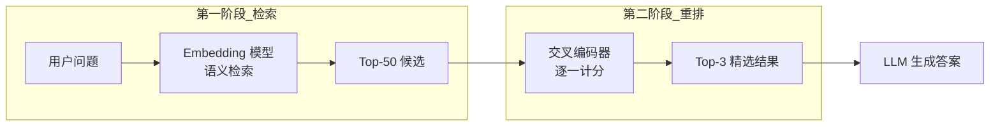

---
tags:
  - RAG
---

# 重排：对检索结果做精细化排序

> 重排（Rerank）是对初步检索结果进行二次排序的过程，用更精确的模型将最相关的文档片段排在前面。

## 这章解决什么问题

向量检索（第一阶段检索）速度快但精度有限。它的相似度是基于 Embedding 向量的整体语义匹配，可能把「苹果很好吃」和「苹果发布了新手机」也算得很近——它们都提到了苹果，但语义方向完全不同。

而 LLM 的上下文窗口有限，只能接受 3~5 个片段。如果最相关的内容被排在倒数第一，LLM 可能漏掉关键信息。

**重排就是解决这个矛盾的**——先用快速的向量检索从百万级候选中召回几十个候选（保召回率），再用精确的交叉编码器排序模型从中精挑细选出最有用的几个（保精确率）。

## 核心概念

### 两阶段检索架构



第一阶段（检索）：用 Embedding 模型快速召回 Top-50 ~ Top-100

第二阶段（重排）：用交叉编码器（Cross-Encoder）对每个候选逐条打分，只保留 Top-3 ~ Top-5

### 向量检索 vs 重排模型

| 维度 | 向量检索（Bi-Encoder） | 重排模型（Cross-Encoder） |
|------|----------------------|--------------------------|
| 处理方式 | 问题和文档分别编码 | 问题和文档拼接后一起编码 |
| 编码速度 | 快（可预先计算文档向量） | 慢（无法预计算，需实时编码） |
| 精度 | 中，丢失交互信息 | 高，能捕捉 query-doc 的语义交互 |
| 适用阶段 | 候选生成（速度快，处理海量数据） | 候选排序（精度高，处理少量数据） |

重排的本质是用精度换时间：把需要高精度的运算限制在少量候选项上。

### 重排的工作原理

以 `BAAI/bge-reranker-v2-m3` 为例：

```
[CLS] 问题：什么是 RAG？ [SEP] 资料：RAG 是检索增强生成 [SEP]
                          ↓
                    Cross-Encoder 模型
                          ↓
                     0.92（相关度分数）
```

输入是问题和文档拼接后的文本对，输出是 0~1 之间的相关度分数。模型能同时看到问题中的每个词和文档中的每个词，捕捉它们之间的交互关系。这就是为什么交叉编码器比双编码器精度更高的原因。

### 常见重排模型

| 模型 | 语言 | 特点 |
|------|------|------|
| `BAAI/bge-reranker-v2-m3` | 中英多语言 | 轻量，适合中文场景 |
| `BAAI/bge-reranker-v2-gemma` | 多语言 | 更强但更重 |
| `Cohere Rerank` | 多语言 | 云端 API，无需本地部署 |
| `cross-encoder/ms-marco-MiniLM-L6-v2` | 英文 | 经典的 MS MARCO 排名模型 |
| `Jina Reranker` | 多语言 | 开箱即用，支持长文本 |

### 重排策略

**策略 1：重排后截断**

最常见的方式。检索返回 Top-50 → 重排 → 取 Top-3：

```python
from langchain.retrievers import ContextualCompressionRetriever
from langchain_community.cross_encoders import HuggingFaceCrossEncoder
from langchain.retrievers.document_compressors import CrossEncoderReranker

retriever = vectorstore.as_retriever(search_kwargs={"k": 20})

reranker = CrossEncoderReranker(
    model=HuggingFaceCrossEncoder(model_name="BAAI/bge-reranker-v2-m3"),
    top_n=3,
)
compression_retriever = ContextualCompressionRetriever(
    base_compressor=reranker,
    base_retriever=retriever,
)

results = compression_retriever.invoke("什么是 RAG？")
```

**策略 2：用 LLM 做重排**

你不一定要用专门的 Rerank 模型。LLM 也可以做排序——虽然慢一些，但理解能力更强：

```python
rerank_prompt = f"""
请根据相关性对以下文档片段排序（从最相关到最不相关）。
返回排序后的序号。只返回序号，用逗号分隔。

问题：{query}

文档：
1: {doc_1}
2: {doc_2}
3: {doc_3}
"""
```

这种方式的优点是零配置，缺点是成本高、延迟大。

**策略 3：MMR（最大边际相关性）**

MMR 不追求「最相关」，而是追求「相关信息最大覆盖」——即在相关性高的前提下，尽量选择候选之间差异大的：

```python
from langchain.vectorstores import Chroma

retriever = vectorstore.as_retriever(
    search_type="mmr",
    search_kwargs={"k": 5, "fetch_k": 20, "lambda_mult": 0.7}
)
```

`lambda_mult=0.7` 表示 70% 权重给相关性，30% 权重给多样性。你在处理多角度问题（如「介绍一下 RAG 的优缺点」）时，MMR 会让回答更全面。

## 最小示例

```python
from sentence_transformers import CrossEncoder

# 准备数据和模型
query = "RAG 的主要优势是什么？"
candidates = [
    "RAG 通过检索外部知识来辅助生成，减少幻觉。",
    "RAG 相比微调更容易更新知识。",
    "RAG 由检索器、生成器和知识库三部分组成。",
    "RAG 的缺点是延迟比直接生成稍高。",
    "RAG 适合需要引用来源的场景。",
]

model = CrossEncoder("cross-encoder/ms-marco-MiniLM-L6-v2")

# 重排
pairs = [(query, doc) for doc in candidates]
scores = model.predict(pairs)

# 按分数排序
ranked = sorted(
    zip(candidates, scores), key=lambda x: x[1], reverse=True
)

print("重排结果：")
for doc, score in ranked:
    print(f"  [{score:.4f}] {doc}")
```

## 常见误区

!!! failure "误区 1：重排是可选步骤，不做也行"
    如果你只用向量检索的 Top-K 结果直接给 LLM，效果可能差 5~10 个百分点。重排在绝大多数场景下都有显著改善。

!!! failure "误区 2：重排模型越大越好"
    重排模型是每次查询都要调用的，不是索引阶段预先计算。模型越重，延迟越高。轻量模型（如 bge-reranker-v2-m3）在多数场景下已经足够。

!!! failure "误区 3：重排只做一次就够"
    当知识库规模很大时，可以考虑**级联重排（Cascaded Rerank）**——先用轻量模型从 Top-100 筛到 Top-20，再用量量模型从 Top-20 筛到 Top-3。既保证精度又控制延迟。

## 延伸阅读

- [检索](retrieval.md) —— 重排的上游步骤
- [生成](generation.md) —— 重排后的结果如何输入 LLM
- [BGE Reranker 论文](https://arxiv.org/abs/2310.11423)
- [Sentence Transformers Cross-Encoder 文档](https://www.sbert.net/examples/applications/cross-encoder/README.html)

## 练习题

??? question "练习：对比重排效果"

    准备一个问题和 10 篇候选文档，其中 2~3 篇是最相关的。分别做以下实验：

    1. 只用向量检索的 Top-3（不重排）→ LLM 生成的答案准确率如何？
    2. 向量检索 Top-20 → Cross-Encoder 重排取 Top-3 → LLM 生成，答案改善了吗？
    3. 尝试不同的重排模型（bge-reranker-v2-m3 vs ms-marco-MiniLM），结果有差异吗？

    用 5 个不同的查询重复上面的实验，你觉得重排至少能提升多少准确率？
