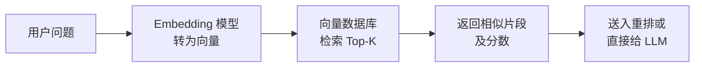

---
tags:
  - RAG
---

# 检索：从知识库中找到相关内容

> 检索（Retrieval）是 RAG 系统的核心环节——在向量数据库中找到与用户问题最相似的那些文本片段。

## 这章解决什么问题

想象你在一个巨大的图书馆里找一本特定的书。如果图书馆没有索引，你得挨个书架找，效率极低。检索就是给知识库建一套高效的索引系统，让每次查询只扫描最可能相关的区域，而不是从头到尾翻一遍。

## 核心概念

### 检索的基本流程



用户提问时，需要将问题也通过同样的 Embedding 模型转换成向量。这一步很容易被忽略但非常重要——检索是基于「问题向量」和「文档向量」之间的相似度，如果模型或参数不同，匹配效果会大幅下降。

### 语义检索 vs 关键词检索

| 维度 | 语义检索（Semantic / Dense） | 关键词检索（Lexical / Sparse） |
|------|-----------------------------|-------------------------------|
| 原理 | 用 Embedding 模型理解语义 | 用 BM25/TF-IDF 匹配关键词 |
| 优势 | 理解同义词、近义表达 | 精确匹配专有名词（如产品型号） |
| 劣势 | 对罕见词和专有名词敏感度低 | 不理解语义，「苹果」搜不到「iPhone」 |
| 场景 | 开放域问答、多轮对话 | 搜索文档标题、代码片段 |
| 工具 | 向量数据库 | Elasticsearch、Whoosh |

实践中，很多系统采用**混合检索（Hybrid Search / Multi-Recall）**——同时用语义检索和关键词检索，分别取 Top-K，然后合并去重。混合检索往往比单一方式更鲁棒。

```python
from langchain.retrievers import EnsembleRetriever
from langchain_community.retrievers import BM25Retriever
from langchain_community.vectorstores import Chroma
from langchain_openai import OpenAIEmbeddings

# 语义检索
vectorstore = Chroma.from_texts(chunks, OpenAIEmbeddings())
semantic_retriever = vectorstore.as_retriever(search_kwargs={"k": 5})

# 关键词检索
keyword_retriever = BM25Retriever.from_texts(chunks, k=5)

# 混合检索
ensemble_retriever = EnsembleRetriever(
    retrievers=[semantic_retriever, keyword_retriever],
    weights=[0.6, 0.4],  # 语义检索权重更高
)

results = ensemble_retriever.invoke("什么是 RAG？")
```

### Top-K 的选择

K 值决定了送入 LLM 的片段数量：

| K 值 | 优点 | 缺点 | 适用场景 |
|------|------|------|---------|
| 1~2 | 上下文纯净，LLM 注意力集中 | 单一来源，信息可能不够 | 简单事实查询 |
| 3~5 | 信息充分，容错性高 | 可能包含无关信息 | 通用问答 |
| 6~10 | 覆盖全面，减少遗漏 | LLM 可能被大量文本分散注意力 | 复杂推理、多角度分析 |

K 值不是越大越好。送入过多的片段会稀释 LLM 对关键信息的注意力，而且增加了 token 成本和延迟。

### 检索结果的质量指标

评估检索有两个来自信息检索的经典指标：

- **精确率（Precision，查准率）**：返回的 K 个结果中，有多少是真正相关的
- **召回率（Recall，查全率）**：知识库中所有相关文档，被检索回来的占比

用公式更好理解：

```
相关文档（在知识库中）：        ● ● ● ● ●（共 5 篇）
检索返回的 Top-3：              ● ■ ■      ← 只有第 1 篇相关

精确率 = 1/3 ≈ 0.33  （返回的 3 篇中有 1 篇相关）
召回率 = 1/5 = 0.20   （总共 5 篇相关只找回 1 篇）
```

两者存在矛盾：K 越大，召回率 ↑（多找回一些相关文档），但精确率 ↓（混进更多不相关的）；K 越小则相反。重排环节的作用就是先用大 K 保召回，再用精确模型提高 Top 结果的精确率。

### 检索策略进阶

除了标准的向量检索，还有一些进阶策略：

**Query 重写（Query Rewriting）**

用户的问题往往很简短（如「那个多少钱？」），缺乏上下文。Query 重写在检索前先把问题扩展成更完整的查询：

```python
rewrite_prompt = "请将以下用户问题改写成更适合搜索的完整句子：\n{query}"
query = llm.invoke(rewrite_prompt)
results = vectorstore.similarity_search(query)
```

**HyDE（Hypothetical Document Embeddings）**

HyDE 的思路很巧妙：如果一个真实文档和问题相似，那模型「假设」的回答文档应该和真实文档更相似。所以先让 LLM 生成一段假设回答，再用这段假设回答去检索，往往能找到更匹配的文档。

**Multi-Query Retrieval（多查询检索）**

同一个问题可能有多重解读视角。用 LLM 生成 3~5 个不同的搜索词，分别检索后合并结果：

```python
queries_prompt = f"针对问题 '{query}'，给出 5 个不同角度的搜索查询："
queries = llm.invoke(queries_prompt).split("\n")

all_results = []
for q in queries:
    all_results.extend(vectorstore.similarity_search(q, k=3))
```

## 最小示例

一个完整的检索循环，包含 Query 重写和混合检索：

```python
import openai
import numpy as np

# ── 1. 初始化知识库（简化的内存向量库）──
chunks = [
    "RAG 是 Retrieval-Augmented Generation，检索增强生成。",
    "文档切分（Chunking）是把长文本切成小片段的过程。",
    "向量化（Vectorization）是把文本转换为数值向量。",
]

response = openai.embeddings.create(
    model="text-embedding-3-small", input=chunks
)
chunk_vecs = np.array([d.embedding for d in response.data])

def search(query, k=2):
    """简单的向量检索函数"""
    q_resp = openai.embeddings.create(
        model="text-embedding-3-small", input=[query]
    )
    q_vec = np.array(q_resp.data[0].embedding)
    scores = np.dot(chunk_vecs, q_vec) / (
        np.linalg.norm(chunk_vecs, axis=1) * np.linalg.norm(q_vec)
    )
    top_k = np.argsort(scores)[::-1][:k]
    return [(chunks[i], scores[i]) for i in top_k]

# ── 2. 用户提问 ──
raw_query = "RAG 是什么？"
# 简易 Query 重写：用 gpt-4o-mini 扩展
rewrite_response = openai.chat.completions.create(
    model="gpt-4o-mini",
    messages=[{
        "role": "user",
        "content": f"重写以下问题使其更适合搜索：{raw_query}"
    }],
)
rewritten = rewrite_response.choices[0].message.content

results = search(rewritten or raw_query, k=2)
print("检索结果：")
for text, score in results:
    print(f"  [{score:.4f}] {text}")
```

## 常见误区

!!! failure "误区 1：「检索」只是查向量数据库"
    向量检索只是第一步。Query 重写、HyDE、混合检索等策略往往能显著提升最终的检索质量。很多 RAG 系统只实现了基础的向量检索，空间还很大。

!!! failure "误区 2：K 值越大越好"
    过大的 K 值让 LLM 的上下文被非核心内容挤满，反而降低回答质量。建议从 K=3~5 开始，根据实际效果调整。

!!! failure "误区 3：Top-1 就够用了"
    Top-1 的结果可能错误或偏差。保留多个候选项，让后续的 Rerank 或 LLM 自己从多段文本中提取信息，容错性更高。

## 延伸阅读

- [向量化](vectorization.md) —— 检索的数据基础
- [重排](rerank.md) —— 检索结果的二次排序
- [生成](generation.md) —— 检索结果如何输入 LLM
- [BM25 算法详解](https://zh.wikipedia.org/wiki/BM25)

## 练习题

??? question "练习：评估你的检索效果"

    准备 10 个问题及其标准答案。用你选择的检索方案（语义 / 关键词 / 混合）对整个知识库检索，计算：

    1. **Top-1 准确率**：第一个结果里有正确答案的比例
    2. **Top-5 召回率**：前 5 个结果里有正确答案的比例
    3. **平均检索时间**：每次检索的平均延迟

    然后尝试：

    - 把 Embedding 模型换成另一个（如 small → large），Top-1 准确率有变化吗？
    - 添加 Query 重写后，检索效果改善了吗？
    - 如果加入混合检索（语义 + BM25），召回率上升还是下降？
