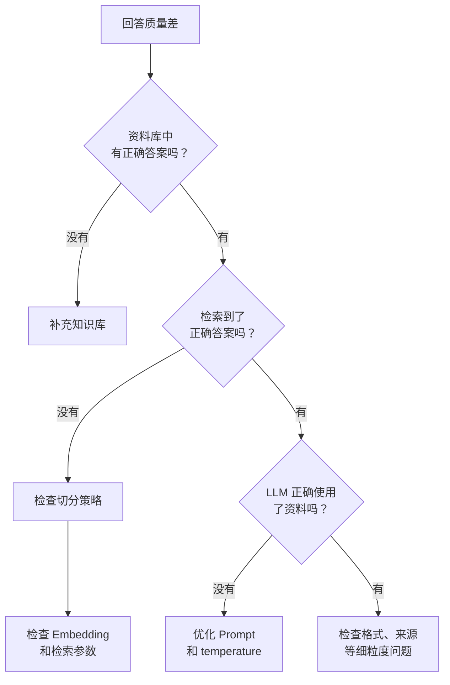

---
tags:
  - RAG
---

# RAG 常见问题与调试

> RAG 系统的失败模式是多样的——回答不好可能因为任何一个环节存在缺陷。这章帮你系统性定位问题。

## 这章解决什么问题

你的 RAG 系统上线了。用户问了一个看起来很简单的问题，但 LLM 给出了一个离谱的答案。

是检索没找到正确的资料？是 LLM 忽略了资料？是切分切断了关键信息？还是 Embedding 模型没理解用户的表达？

RAG 的调试比单环节系统更复杂，因为**每一个环节都可能是瓶颈**。这章提供一套系统性的故障排查思路。

## 核心排查方法论

### RAG 调试的十一问

!!! info "从回答不好到找到根因的排查路径"

    1. **资料库里有正确答案吗？**
        - 先去知识库里手动搜一下。如果库里就没有答案，RAG 不可能给出正确答案
        - 如果资料不全 → 补充知识库

    2. **资料被正确切分了吗？**
        - 找到包含答案的原始片段，看它是否被切散到了多个 chunk 中
        - 是否在 chunk 边界处被截断？
        - 如果切分有问题 → 调整切分策略（用更大 chunk size 或语义切分）

    3. **切分后的 chunk 语义完整吗？**
        - 逐个检查被你命中的 chunk，上下文是否自包含？
        - chunk 包含的信息是否完整到能独立回答问题？
        - 不完整？→ 增加 chunk size 或 chunk_overlap

    4. **用户提问和答案之间的语义鸿沟大吗？**
        - 用户说「怎么取消」，答案叫「退款政策」——虽然相关但不完全匹配
        - 语义鸿沟大？→ 在索引中加入同义词或别名，或者直接用 LLM 做 Query 重写

    5. **Embedding 模型能捕捉这种语义关系吗？**
        - 手动算一下用户问题和 chunk 之间的相似度
        - 相似度明显偏低？→ 换更合适的 Embedding 模型（如针对中文场景优化）

    6. **Top-K 够用吗？**
        - K=3 只返回了 3 个 chunk，正确答案排在第四
        - K 太小？→ 增加 K 值，然后配合重排提高精确率

    7. **重排模型有没有把正确答案排下去？**
        - 检查正确答案在重排前后的排名变化
        - 重排分数偏低？→ 检查重排模型是否适配当前语言/领域，或者重排的候选集是否足够大

    8. **LLM 用上了资料吗？**
        - 把 LLM 的 Prompt 打印出来，看资料有没有正确传递到 LLM 的输入中
        - 如果资料传过去了但 LLM 没用 → 强化 Prompt 约束
        - 如果资料根本没传 → 检查你的代码

    9. **Prompt 约束足够强吗？**
        - Prompt 里说了「只根据资料回答」吗？
        - 说了「如果找不到相关信息就说不知道」吗？
        - 约束不够 → 优化 Prompt

    10. **temperature 高不高？**
        - temperature > 0.5 会增加 LLM 的生成随机性
        - 对于 RAG 场景，0.1~0.3 更合适

    11. **是不是 token 限制被截断了？**
        - 如果 Prompt 加上资料后超过了模型的上下文窗口，后边的资料会被截掉
        - 截断了？→ 减少 K 值或 chunk size，或使用更大上下文窗口的模型

### 快速诊断表



### 生产环境的调试技巧

**1. 记录检索日志**

在每个查询中记录：用户问题、检索到的 Top-K 片段及分数、重排后的片段及分数、最终 Prompt、LLM 回答：

```python
import json

def log_query(user_question, retrieval_results, final_prompt, llm_answer):
    log = {
        "question": user_question,
        "retrieval_top_k": [
            {"text": t, "score": float(s)}
            for t, s in retrieval_results
        ],
        "final_prompt": final_prompt,
        "llm_answer": llm_answer,
    }
    with open("query_log.jsonl", "a", encoding="utf-8") as f:
        f.write(json.dumps(log, ensure_ascii=False) + "\n")
```

有了日志，你就可以离线分析失败模式，而不是在线上盲目调试。

**2. 建立测试集（Golden Dataset）**

收集 50~100 个典型问题和正确答案，自动化跑回归测试：

```python
# golden_dataset.json
[
    {
        "question": "RAG 由哪些部分组成？",
        "expected": ["检索器", "知识库", "生成器"],
        "category": "概念理解"
    },
    {
        "question": "年付套餐怎么退款？",
        "expected": ["30 天内可全额退款", "超过 30 天按比例"],
        "category": "业务政策"
    }
]
```

每次修改系统后，用数据集跑一遍，看**召回率（Retrieval Recall）** 和**回答准确率（Answer Accuracy）** 是否下降。

**3. A/B 测试**

要验证一个改动是否有效，在线上分流对比最可靠。以下变量值得做 A/B 测试：

- 不同切分策略  
- 不同 Embedding 模型  
- 不同 K 值  
- 有/无重排  
- 不同 Prompt 模板  
- 不同 temperature  

每次只改一个变量，观察回答质量指标的变化。

## 各环节常见问题速查

### 切分相关问题

| 症状 | 可能原因 | 解决方案 |
|------|---------|---------|
| 检索到的 chunk 信息不完整 | chunk size 太小或 overlap 不足 | 增加 chunk size 或 overlap |
| 同一个话题被切成多个 chunk | 固定长度切分没考虑语义边界 | 改用语义切分或按标题切分 |
| 检索结果很精确但上下文太少 | 切分太细，chunk 缺少上下文 | 适当增大 chunk size |

### 检索相关问题

| 症状 | 可能原因 | 解决方案 |
|------|---------|---------|
| 完全找不到匹配 | Embedding 模型不合适 | 换一个更适合语种的 Embedding 模型 |
| 分数偏低 | 语义鸿沟大 | 加 Query 重写或用 HyDE |
| 答案在 Top-4，K=3 找不到 | K 值太小 | 增大 K 值，配合重排 |
| 检索结果看似相关但不解决问题 | 语义检索没捕捉到意图 | 加混合检索（语义 + BM25） |

### 重排相关问题

| 症状 | 可能原因 | 解决方案 |
|------|---------|---------|
| 正确答案重排后排到了后面 | Rerank 模型不匹配语言/领域 | 换个 Rerank 模型 |
| 重排后 Top-1 和 Top-3 效果差异不大 | 候选集本身质量高 | 可考虑减少 K 值跳过重排 |
| 重排严重影响延迟 | 模型太大或候选太多 | 换轻量模型，或减少候选数 |

### 生成相关问题

| 症状 | 可能原因 | 解决方案 |
|------|---------|---------|
| LLM 编造了资料中没有的信息 | Prompt 没约束「只根据资料回答」 | 添加约束，降低 temperature |
| LLM 回答了「不知道」但资料里有 | Prompt 在资料前，模型更依赖训练数据 | 把资料放在 Prompt 开头 |
| 回答太长或结构混乱 | 没指定输出格式 | 在 Prompt 中限定格式 |
| 回答了「我不知道」但资料中有 | 上下文被截断 | 减少 K 值或 chunk size |
| 回答自相矛盾 | 多个 chunk 信息冲突 | 检查切分是否产生矛盾片段 |

## 最小示例

```python
import openai
import numpy as np

def diagnose_rag(question, chunks, answer):
    """RAG 问题诊断助手"""
    issues = []

    # 1. 资料中有相关片段吗？
    q_resp = openai.embeddings.create(
        model="text-embedding-3-small", input=[question]
    )
    q_vec = np.array(q_resp.data[0].embedding)

    chunk_resp = openai.embeddings.create(
        model="text-embedding-3-small", input=chunks
    )
    chunk_vecs = np.array([d.embedding for d in chunk_resp.data])
    scores = np.dot(chunk_vecs, q_vec) / (
        np.linalg.norm(chunk_vecs, axis=1) * np.linalg.norm(q_vec)
    )

    best_score = float(np.max(scores))
    if best_score < 0.3:
        issues.append(f"低相似度：最高相似度仅 {best_score:.2f}，可能检索没找到正确内容")
    elif best_score < 0.6:
        issues.append(f"中等相似度：最高 {best_score:.2f}，需要确认结果是否真的相关")
    else:
        issues.append(f"相似度良好（{best_score:.2f}），检索环节可能没问题")

    # 2. 回答中有没有可能编造的内容？
    check_prompt = f"""以下回答完全基于提供的资料吗？
资料（前3个chunk）：{chunks[:3]}
回答：{answer}
是否完全基于资料？回答 Yes 或 No 并说明理由。"""
    check = openai.chat.completions.create(
        model="gpt-4o-mini",
        messages=[{"role": "user", "content": check_prompt}],
        temperature=0,
    )
    issues.append(f"事实性检查结果：{check.choices[0].message.content}")

    return issues

# 使用示例
issues = diagnose_rag(
    question="RAG 是什么？",
    chunks=["RAG 是一种文本生成方法。", "机器学习的应用很广泛。"],
    answer="RAG 是检索增强生成技术。",
)
for issue in issues:
    print(f"- {issue}")
```

## 常见误区

!!! failure "误区 1：最后一个环节出问题就是 LLM 的错"
    多数 RAG 回答质量差的问题，根因在检索环节（没找到正确答案），而不是生成阶段。先检查检索。

!!! failure "误区 2：上线之后就不需要关注了"
    文档更新、用户提问方式变化、Embedding 模型升级——任何一个变动都可能影响 RAG 质量。建议定期跑测试数据集。

!!! failure "误区 3：调试靠直觉"
    不要猜。检索日志、测试集、A/B 测试——三个工具能解决 90% 的 RAG 调试问题。直觉不可靠，数据才可靠。

## 延伸阅读

- [生成](generation.md) —— 调试的常见终点
- [检索](retrieval.md) —— 调试的常见起点
- [为什么需要 RAG](why-rag.md) —— 回顾 RAG 的能力边界
- [RAG 分类与评估](https://docs.llamaindex.ai/en/stable/module_guides/querying/retriever/retrievers/)

## 练习题

??? question "练习 1：一次完整的 RAG 调试"

    假设你的 RAG 系统遇到了以下问题：

    > 用户问：「你们公司的退款政策是什么？」LLM 回答：「一般来说，大多数公司接受 30 天内退款。」

    这个回答明显不对——你们公司的政策是「软件产品一旦激活概不退款」。

    请按照「十一问」排查流程，写出你的排查思路和可能的解决方案。

??? question "练习 2：搭建你的测试数据集"

    为你的 RAG 场景准备 20 个测试用例，每个包含：

    - `question`：用户问题
    - `expected`：期望的回答关键词（3~5 个）
    - `category`：问题类型

    然后写一个脚本：

    1. 用你的 RAG 系统回答这 20 个问题
    2. 判断回答是否包含所有 `expected` 关键词
    3. 输出通过率

    这个测试集将成为你后续所有 RAG 改动的基本验证工具。
