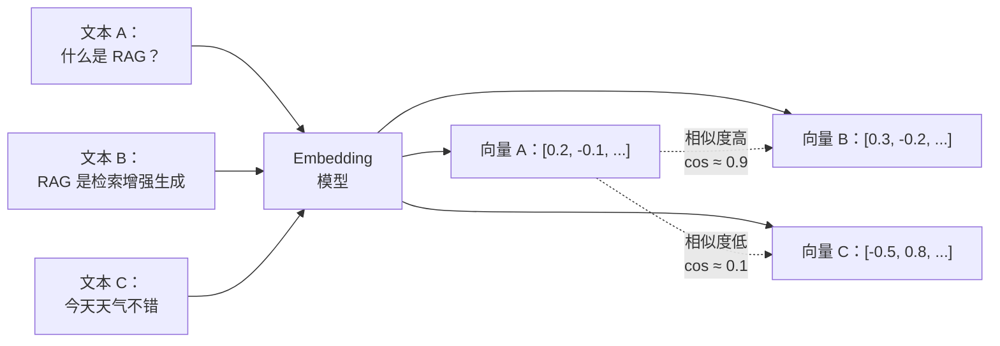

---
tags:
  - RAG
---

# 向量化：把文本变成向量

> 向量化（Vectorization / Embedding）是把文本转换成数值向量的过程，让计算机能在数学空间里衡量「两段文字有多像」。

## 这章解决什么问题

人类判断两段文字是否相关，靠的是语义理解。但计算机看不懂「意思」，只能处理数字。

向量化就是造一座桥，把人类语言翻译成计算机能算的数字序列——**向量（Vector）**。有了这些数字，我们就可以用数学公式计算相似度，实现快速检索。

## 核心概念

### 什么是向量

向量是一组浮点数，比如 `[0.023, -0.157, 0.892, ...]`（通常 256~3072 维）。每个维度代表文本在某个潜在「语义方向」上的分量。

通俗理解：向量就像是给一段文字做的「语义指纹」。两段文字在语义上越接近，它们的向量在空间中就越靠近。



### 相似度计算

有了向量之后，我们需要一个「尺子」来衡量两段文字的语义距离。不同尺子侧重点不同，选择哪个直接影响检索效果。

#### 余弦相似度（Cosine Similarity）

衡量两个向量在方向上的**夹角大小**，不考虑向量长度（模长）。

```
cos(a, b) = (a · b) / (|a| × |b|)
```

| 取值范围 | 含义 |
|---------|------|
| 1 | 方向完全一致（语义最接近） |
| 0 | 正交，不相关 |
| -1 | 方向完全相反（语义最远） |

Python 实现：

```python
import numpy as np

def cosine_similarity(a, b):
    return np.dot(a, b) / (np.linalg.norm(a) * np.linalg.norm(b))

vec_a = np.array([0.2, -0.1, 0.5])
vec_b = np.array([0.3, -0.2, 0.4])
print(f"余弦相似度：{cosine_similarity(vec_a, vec_b):.4f}")
```

**适用场景**：语义搜索、文本相似度判断、信息检索。这是 RAG 中最常用的指标，因为它只关心方向（语义倾向），不受文本长度影响。

!!! tip "OpenAI embeddings 已经归一化"
    OpenAI 的 `text-embedding-3-small` 和 `text-embedding-3-large` 输出默认是 L2 归一化的（模长为 1）。此时余弦相似度等价于点积，可以省去分母计算。

#### 点积相似度（Dot Product / Inner Product）

直接计算两个向量的内积：

```
dot(a, b) = a₁b₁ + a₂b₂ + ... + aₙbₙ
```

```python
def dot_product(a, b):
    return np.dot(a, b)

print(f"点积：{dot_product(vec_a, vec_b):.4f}")
```

| 特点 | 说明 |
|------|------|
| 与余弦的关系 | 当向量已 L2 归一化时，点积 = 余弦相似度 |
| 未归一化时 | 同时受方向和模长影响——模长长的向量更容易得高分 |
| 取值范围 | 无固定边界，取决于向量维度和数值范围 |

**适用场景**：
- 向量已归一化时：直接替代余弦相似度，计算更快（省一次模长运算）
- 向量未归一化时：适合对「高频/长文档」有偏好的场景（如长文本比短文本更值得被检索到）

#### 欧氏距离（Euclidean Distance / L2）

衡量两个向量在多维空间中的**直线距离**。距离越小越相似。

```
L2(a, b) = √[(a₁ - b₁)² + (a₂ - b₂)² + ... + (aₙ - bₙ)²]
```

```python
def euclidean_distance(a, b):
    return np.linalg.norm(a - b)

def euclidean_similarity(a, b):
    """将距离转为相似度分数，方便统一比较"""
    return 1 / (1 + euclidean_distance(a, b))
```

**与余弦相似度的关键区别**：

| 维度 | 余弦相似度 | 欧氏距离 |
|------|-----------|---------|
| 关注点 | 方向夹角 | 绝对距离 |
| 受向量长度影响 | 否 | 是 |
| 举例 | (1,0) 与 (10,0) 的 cos=1，完全相同 | (1,0) 与 (10,0) 的 L2=9，差异很大 |

**适用场景**：当向量长度本身携带语义信息时（比如向量的模长代表「信息量」或「置信度」），欧氏距离能同时捕捉方向和大小的差异。

#### 曼哈顿距离（Manhattan Distance / L1）

计算两个向量在各维度上的**绝对差之和**：

```
L1(a, b) = |a₁ - b₁| + |a₂ - b₂| + ... + |aₙ - bₙ|
```

```python
def manhattan_distance(a, b):
    return np.sum(np.abs(a - b))
```

**与欧氏距离对比**：曼哈顿距离对单个维度的异常差异不那么敏感（不取平方）。在高维空间中，曼哈顿距离有时比欧氏距离更稳定（缓解「维度灾难」）。但 Embedding 检索中较少直接使用曼哈顿距离。

#### 各指标对比总结

```python
import numpy as np

def compare_metrics(a, b):
    """一次性输出多种相似度指标"""
    cos = np.dot(a, b) / (np.linalg.norm(a) * np.linalg.norm(b))
    dot = np.dot(a, b)
    l2 = np.linalg.norm(a - b)
    l1 = np.sum(np.abs(a - b))

    return {
        "余弦相似度": cos,
        "点积": dot,
        "欧氏距离": l2,
        "欧氏相似度": 1 / (1 + l2),
        "曼哈顿距离": l1,
    }

v1 = np.array([0.2, -0.1, 0.5])
v2 = np.array([0.3, -0.2, 0.4])
v3 = np.array([-0.5, 0.8, 0.1])

for name, val in compare_metrics(v1, v2).items():
    print(f"{name}: {val:.4f}")
```

在 RAG 实践中，**余弦相似度是默认选择**，其次是点积（向量归一化后等效于余弦）。欧氏距离作为补充，适合向量长度携带信息的场景。向量数据库（FAISS、Milvus 等）通常同时支持多种距离度量，可以在建索引时通过参数指定。

### Embedding 模型的选择

Embedding 模型（也叫向量化模型）的质量直接决定检索效果。常见选项：

| 模型 | 维度 | 特点 | 适用场景 |
|------|------|------|---------|
| `text-embedding-3-small` | 1536 | OpenAI，性价比高，支持 256 维截断 | 通用场景 |
| `text-embedding-3-large` | 3072 | OpenAI，精度更高，成本也更高 | 精度优先的场景 |
| `BAAI/bge-large-zh-v1.5` | 1024 | 中文优化，开源 | 中文场景 |
| `intfloat/multilingual-e5-large` | 1024 | 多语言，包含中文 | 多语言场景 |
| `text2vec-large-chinese` | 1024 | 国产中文模型 | 中文专用场景 |

选择建议：

1. **优先用 Embedding 模型，不用通用 LLM**：LLM 最后一层的 hidden state 不是为相似度任务优化的，效果通常不如专门的 Embedding 模型
2. **中文场景优先考虑中文优化的模型**：OpenAI 的模型也支持中文，但中文优化的模型（如 bge-large-zh）在纯中文场景可能更好
3. **维度不是越高越好**：维度高意味着更多存储和计算。OpenAI 支持设置 `dimensions` 参数进行降维，从 1536 降低到 256 还能保持 95%+ 的性能

### 向量数据库

当知识库只有几十个片段时，你可以像上面的示例一样直接在内存中做余弦相似度计算。但当片段数量达到数万、数百万时，就需要一个专门的**向量数据库（Vector Database）**。

向量数据库的核心能力是**近似最近邻搜索（ANN，Approximate Nearest Neighbor）**——不像暴力扫描那样精确但慢，而是用索引算法（HNSW、IVF 等）在可接受的精度损失下大幅提升检索速度。

| 工具 | 类型 | 规模 | 特点 |
|------|------|------|------|
| **Chroma** | 本地嵌入式 | 小规模 | 简单易用，适合原型 |
| **FAISS** | 本地库 | 中大规模 | Meta 开源，性能好 |
| **Milvus** | 分布式 | 大规模 | 云原生，功能完整 |
| **Weaviate** | 分布式 | 中大规模 | 原生支持多种 Embedding 模型 |
| **Qdrant** | 分布式 | 中大规模 | Rust 实现，性能优异 |
| **PostgreSQL + pgvector** | 扩展 | 中规模 | 如果你已经在用 Postgres |

用 LangChain 集成向量数据库非常简单：

```python
from langchain_community.vectorstores import Chroma
from langchain_openai import OpenAIEmbeddings

# 生成向量并存入 Chroma
embeddings = OpenAIEmbeddings(model="text-embedding-3-small")
vectorstore = Chroma.from_texts(
    texts=chunks,
    embedding=embeddings,
    persist_directory="./chroma_db"
)

# 检索
results = vectorstore.similarity_search("什么是 RAG？", k=3)
```

### Token 数量与成本控制

向量化的成本跟文本长度直接相关。以 OpenAI 为例：

- `text-embedding-3-small`：$0.02 / 1M token
- `text-embedding-3-large`：$0.13 / 1M token

如果知识库有 100 万 token（大约 3~4 本 300 页的书），small 模型的向量化成本约 $0.02，但存储为 1536 维浮点数后占用约 6MB。如果使用大型知识库需要考虑存储和内存占用。

## 最小示例

以下代码对比 OpenAI 和本地模型的向量化效果：

```python
import openai

# ── 使用 OpenAI Embedding ──
response = openai.embeddings.create(
    model="text-embedding-3-small",
    input=["什么是 RAG？", "RAG 是检索增强生成"],
    dimensions=256  # 降维，节省存储
)
vectors = [d.embedding for d in response.data]
print(f"向量维度：{len(vectors[0])}")   # 256（通过 dimensions 降维）
print(f"向量前 5 维：{vectors[0][:5]}")

# ── 使用 Sentence Transformers（本地，适合离线）──
from sentence_transformers import SentenceTransformer

model = SentenceTransformer("BAAI/bge-large-zh-v1.5")
embeddings = model.encode(["什么是 RAG？", "RAG 是检索增强生成"])
print(f"本地模型向量维度：{len(embeddings[0])}")  # 1024
print(f"相似度矩阵形状：{embeddings.shape}")
```

## 常见误区

!!! failure "误区 1：越贵的 Embedding 模型效果越好"
    不一定。OpenAI 的 large 模型比 small 模型贵 6.5 倍，但在 MTEB 基准上只高出不到 5 个点。对于大多数应用场景，small 模型已经足够。如果 budget 有限，先用 small。

!!! failure "误区 2：Embedding 模型选好后就不用管了"
    Embedding 模型持续在进化。建议每隔 6~12 个月重新评估一次（尤其是中文场景），看看更新的模型能否提升检索效果。Embedding 替换后需要重新索引全部知识库。

!!! failure "误区 3：向量相似度 = 语义相似度"
    向量相似度是语义相似度的一种近似。它可能把同义词算得很近（好的），也可能把反义词算得很近（不好）。比如「喜欢」和「讨厌」的向量可能比较接近，因为它们在很多语境中互换出现。

## 延伸阅读

- [文档切分](chunking.md) —— 向量化之前，文本先要切好
- [检索](retrieval.md) —— 向量化之后，如何用向量搜索
- [什么是多模态 AI](../basics/multimodal-ai.md) —— Embedding 思想在图像领域的应用

## 练习题

??? question "练习 1：对比不同 Embedding 模型"

    准备 5 个中文句子（主题尽量不同），分别用以下方式计算两两之间的余弦相似度：

    1. 用 OpenAI `text-embedding-3-small`
    2. 用本地 `BAAI/bge-large-zh-v1.5`（或 `shibing624/text2vec-base-chinese`）
    3. 用 One-Hot 编码 + Jaccard 相似度（最简单的基线）

    对比三者的结果：哪些句子对在语义模型下相似度很高，但在 One-Hot 下很低？这说明什么？

??? question "练习 2：计算你的知识库向量化成本"

    假设你有一个 10 万 token 的中文文档库，需要选择合适的 Embedding 模型和向量数据库。回答：

    1. 用 `text-embedding-3-small`（$0.02/1M token）的成本是多少？
    2. 用 `text-embedding-3-large`（$0.13/1M token）的成本是多少？
    3. 存储 1536 维 vs 256 维向量，存储空间差多少倍？
    4. 如果每天有 100 次查询，每次返回 Top-5，用 FAISS 和暴力扫描对延迟的影响大概差多少？
