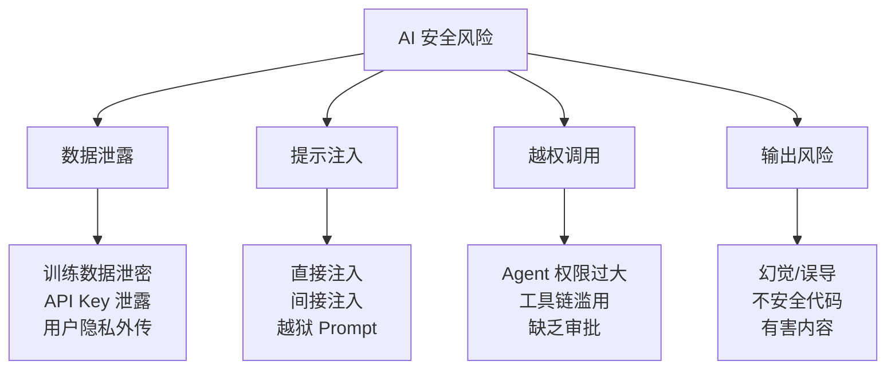

---
tags:
  - Safety
---

# AI 与大模型安全总览

> 安全不是附加题，是基本题。AI 系统上线之前，就应该想清楚输入怎么控、权限怎么管、输出怎么查。

## 这章解决什么问题

很多人第一次接触 AI 时，注意力全放在"能不能做"上：这个模型能写代码吗？能分析 PDF 吗？能调用工具吗？

很少人第一时间想的是"如果出了问题怎么办"。

但 AI 系统有几个和传统软件不一样的特性，让安全问题变得更隐蔽、更难防范：

- **模型不可控**：你无法精确指定 LLM 输出什么，它生成的内容天然不可预测
- **权限放大**：当模型能调用 API、读写数据库、发送邮件时，一个不安全的 Prompt 可能导致自动化操作被滥用
- **幻觉和误导**：模型输出的错误信息如果被直接使用，可能造成比程序 bug 更严重的后果
- **数据难以撤回**：数据一旦被发送给第三方模型 API，你基本无法保证它被删除或不被用于训练

所以这章不讲吓人的故事，也不会说"AI 很危险你别用了"。我们帮你建立一套**可操作的安全思考框架**，让你在开发或使用 AI 产品时，知道从哪里开始检查、怎么防御、怎么兜底。

## AI 安全的核心问题

AI 系统的安全问题和传统网络安全有很大重叠，但也有几个 LLM 特有的风险维度。

### 数据泄露 (Data Leakage)

你在使用 AI 产品时，输入的内容（对话、文件、代码）可能被发送到模型服务端。如果这些数据包含密码、密钥、客户信息或内部文档，一旦外传就无法收回。

### 提示注入 (Prompt Injection)

攻击者通过构造特殊输入，让模型忽略原有指令，执行攻击者想要的动作。这是 LLM 独有的安全威胁，在传统软件中没有直接对应。

### 越权调用 (Over-Permission)

当 AI Agent 被赋予工具调用权限时，如果权限范围没有收敛，一个看似无害的 Prompt 可能触发删除数据、发送邮件、修改配置等危险操作。

### 不安全输出 (Unsafe Output)

模型可能生成不安全的代码、有害建议、虚假信息或侵权内容。如果输出不经检查直接使用，下游系统和用户可能受到损害。

## 一个最小安全框架

把 AI 系统当做一个"不可信的新员工"来管理：

| 层次 | 问题 | 做法 |
|------|------|------|
| 输入层 | 用户能传什么？ | 输入过滤、敏感信息检测、Prompt 加固 |
| 权限层 | Agent/模型能做什么？ | 最小权限原则、人工审批、操作白名单 |
| 输出层 | 模型出来的东西能用吗？ | 输出检查、内容审查、人工复核 |
| 审计层 | 出事能找到原因吗？ | 全链路日志、输入输出记录、异常告警 |

这个框架不复杂，但每一层都需要具体落地。后面的章节会逐一展开。

## 延伸阅读

- [OWASP Top 10 for LLM Applications](https://genai.owasp.org/llm-top-10/) — LLM 应用安全行业参考标准
- [OpenAI Safety Best Practices](https://developers.openai.com/api/docs/guides/safety-best-practices) — OpenAI 官方安全建议
- [数据泄露](./data-leakage.md)、[提示注入](./prompt-injection.md)、[越权调用](./over-permission.md)、[使用边界与合规提示](./compliance.md)

## 练习题 / 小实验

1. **安全检查清单**：找一个你常用的 AI 产品（ChatGPT、Claude、GitHub Copilot 等），列出它可能涉及的安全风险，对应到这个框架的哪个层次？
2. **风险分级**：假设你要做一个"AI 客服助手"，能读取用户订单、查询库存、发送退款申请。列出它可能的安全风险，并按严重程度排序。
